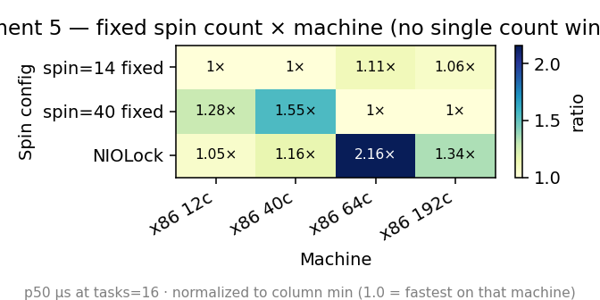
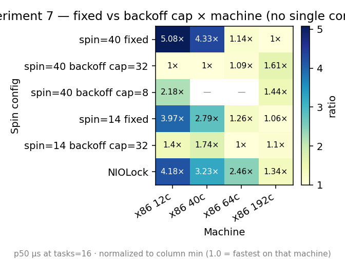
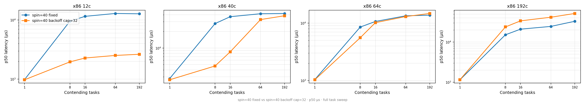

# Mutex Benchmark Experiments & Results

Systematic investigation of Swift `Synchronization.Mutex` Linux performance, conducted on two machines:
- **x86 64c**: AMD EPYC 9454P, 157 GB RAM, chiplet (CCD) architecture
- **x86 12c**: Intel i5-12500, 62 GB RAM, single-die

All results are p50 wall clock in microseconds unless noted. Workload: 50,000 total acquires of a `[Int: UInt64]` dictionary with 64 entries, work=1 (single map update per acquire), pause=0.

## Implementation labels

All `spin=N` variants, `PlainFutexMutex (spin=100)`, and `Optimal` use `PlainFutexMutex<Value>` (`FUTEX_WAIT`/`FUTEX_WAKE`) with different spin parameters. The label indicates the configuration:

| Label | Implementation | Futex | Spin |
|---|---|---|---|
| Synchronization.Mutex | Real stdlib | `FUTEX_LOCK_PI` | 1000 x `pause` (x86) / 100 x `wfe` (aarch64) |
| Synchronization.Mutex (copy) | `SynchronizationMutex<Value>` - extracted stdlib copy | `FUTEX_LOCK_PI` | same, configurable |
| PlainFutexMutex (spin=100) | `PlainFutexMutex` spin=100, no backoff | `FUTEX_WAIT`/`FUTEX_WAKE` | 100 fixed |
| spin=N fixed | `PlainFutexMutex` spinTries=N, no backoff | `FUTEX_WAIT`/`FUTEX_WAKE` | N x 1 `pause` |
| spin=N backoff cap=M | `PlainFutexMutex` spinTries=N, backoffCap=M | `FUTEX_WAIT`/`FUTEX_WAKE` | N iters, exponential 1,2,4..M |
| spin=N backoff adaptive | `PlainFutexMutex` backoffCap=`256/nproc` | `FUTEX_WAIT`/`FUTEX_WAKE` | N iters, cap auto-tuned |
| spin=N regime-gated | `PlainFutexMutex` regimeGatedCap=true | `FUTEX_WAIT`/`FUTEX_WAKE` | N iters, cap flips by lock state |
| Optimal | `OptimalMutex` - standalone, no knobs | `FUTEX_WAIT`/`FUTEX_WAKE` | 14 iters, regime-gated baked in |
| PI no-spin | `SynchronizationMutex` spinTries=0 | `FUTEX_LOCK_PI` | 0 (straight to kernel) |
| NIOLockedValueBox | `pthread_mutex_t` wrapper (swift-nio) | `FUTEX_WAIT`/`FUTEX_WAKE` (glibc) | 0 (park immediately) |
| pthread_adaptive_np | `pthread_mutex_t` ADAPTIVE_NP | `FUTEX_WAIT`/`FUTEX_WAKE` (glibc) | 100 + glibc backoff+jitter |

`PlainFutexMutex (spin=100)` is **not** the stdlib. It is `PlainFutexMutex` with default spin=100, using plain futex (`FUTEX_WAIT`/`FUTEX_WAKE`) instead of PI-futex. Previously labeled `Synchronization.Mutex (plain)` in older results.

---

## Experiment 1: Faithful stdlib copy validation

**Question:** Can we extract the stdlib Mutex implementation and benchmark it without rebuilding the toolchain?

**Method:** Copied `LinuxImpl.swift` into a standalone `SynchronizationMutex<Value>` class. Replaced `Atomic<UInt32>` with C atomics (GCC builtins), LLVM intrinsics with C inline asm. Made generic with `withLock` API matching stdlib.

**Result (tasks=1):** Copy tracks stdlib within 5% — extraction is faithful.

**Finding:** Initial non-generic version had lock word on separate heap allocation (different cache line from value). This made the copy ~2× faster at high contention — not algorithmic, just memory layout. Fixed by colocating lock word + value in single buffer allocation matching stdlib `Mutex<Value>` layout.

---

## Experiment 2: Plain futex vs PI-futex

**Question:** Does replacing `FUTEX_LOCK_PI` with `FUTEX_WAIT`/`FUTEX_WAKE` fix the regression?

**Method:** Implemented `PlainFutexMutex<Value>` with 3-state lock word (0=unlocked, 1=locked, 2=locked+waiters). Same spin count (100) as initial test.

**Result (64-core, tasks=16):**

| Implementation | p50 (µs) | vs NIOLock |
|---|---:|---|
| Plain futex + 100 spin | 11,198 | 2.0× faster |
| NIOLock | 22,610 | baseline |
| Stdlib PI + 1000 spin | 827,326 | 36× slower |

**Explanation:** Plain futex unlock stores 0 in userspace, then wakes. Spinners can acquire in the window between store(0) and woken waiter's CAS. This is why spinning exists in every non-PI implementation (glibc, Go, WebKit, Rust).

---

## Experiment 3: PI-futex without spinning

**Question:** Is the PI-futex syscall itself expensive, or just the combination with spinning?

**Method:** Set `spinTries=0` on the PI-futex copy — straight to `FUTEX_LOCK_PI` on contention.

**Result:**

| Machine | PI no-spin | Stdlib PI (1000 spin) | Plain futex spin=0 | NIOLock |
|---|---:|---:|---:|---:|
| 64-core, t=16 | 780,141 | 828,000 | 18,800 | 22,900 |
| 12-core, t=16 | 95,683 | 11,911 | 8,856 | 9,634 |

**Key finding:** PI-futex syscall is **10.8× more expensive** than plain futex on 12-core, **43× more expensive** on 64-core. The 1000-spin loop in stdlib is damage control — it avoids the PI kernel path ~95% of the time. Removing spinning without replacing PI-futex makes performance 10× worse.

On 64-core: PI no-spin ≈ PI with spinning (780ms vs 828ms). The spin is useless here (kernel handoff), but the PI syscall dominates either way.

---

## Experiment 4: glibc PTHREAD_MUTEX_ADAPTIVE_NP

**Question:** Does glibc's built-in adaptive spinning help?

**Method:** `pthread_mutex_t` initialized with `PTHREAD_MUTEX_ADAPTIVE_NP` attribute. glibc provides 100 spins with exponential backoff + random jitter. Available since glibc 2.2; musl ignores the attribute.

**Result:** Tracks NIOLock within 5-10% on both machines. No measurable benefit over park-immediately (`PTHREAD_MUTEX_NORMAL`).

**Conclusion:** glibc's adaptive strategy doesn't help with very short critical sections in this workload.

---

## Experiment 5: Spin count sweep

**Question:** What's the optimal spin count for plain futex?

**Method:** Tested spin=0, 14, 40, 100 with fixed (1 pause per iteration) strategy across four machines.

**Result - fixed spin (no backoff) across machines, tasks=16 (p50 us):**

| Config | x86 12c | x86 40c | x86 64c | x86 192c |
|---|---:|---:|---:|---:|
| spin=14 fixed | 9,052 | 23,855 | 11,796 | 22,266 |
| spin=40 fixed | **11,575** | **36,995** | 10,658 | **21,037** |
| NIOLock | 9,519 | 27,591 | 23,020 | 28,131 |



Cells are p50 normalized to the column minimum — 1.0 = fastest on that machine. `spin=14` wins on 12c/40c, `spin=40` wins on 64c/192c; no row is consistently 1.0.

**Fixed spin gets worse as oversubscription increases.** On 12-core with 16 tasks (1.3x oversubscribed), spin=40 fixed is **1.2x slower than NIO** - the spin burns CPU the lock owner needs. On 40-core with 16 tasks (not oversubscribed), spin=40 is 1.3x slower than NIO because cross-NUMA spinning thrashes cache lines. Only on 64-core does fixed spin win (2.1x faster than NIO).

**Full task sweep on 12-core shows the regression grows with contention:**

| Tasks | spin=40 fixed | NIOLock | spin=40 fixed vs NIO |
|---:|---:|---:|---|
| 1 | 978 | 1,348 | 1.4x faster |
| 8 | 9,576 | 9,544 | ~same |
| 16 | **11,575** | **9,519** | **1.2x SLOWER** |
| 64 | **12,943** | **9,822** | **1.3x SLOWER** |
| 192 | **12,771** | **9,986** | **1.3x SLOWER** |

At tasks=1 (uncontended), fixed spin wins because it avoids the futex syscall. At tasks>=16, the 12 cores are oversubscribed and fixed spinning wastes CPU the lock owner needs to run and release.

**On 192-core, spin=40 fixed wins but spin=40 backoff cap=32 loses badly:**

| Config | tasks=16 | tasks=64 | tasks=192 |
|---|---:|---:|---:|
| spin=40 fixed | 21,037 | 24,625 | 33,112 |
| spin=40 backoff cap=32 | **33,882** | **41,714** | **51,741** |
| NIOLock | 28,131 | 33,063 | 41,878 |

cap=32 backoff on 192 cores at tasks>=64 is **worse than NIO** - the long backoff delays between CAS checks mean the spinner misses release windows. Fixed spin with tight 1-pause-per-iteration actually works better here because 192 cores means minimal oversubscription. This is what led to the regime-gated approach (Experiment 11).

Consistent with WebKit's finding: "broad plateau of near-optimal settings between about 10 and 60 spins" ([Filip Pizlo, 2016](https://webkit.org/blog/6161/locking-in-webkit/)). But the plateau only holds when tasks roughly equal cores. Under oversubscription, any fixed spin count regresses.

---

## Experiment 6: sched_yield and earlyExitOnWaiters

**Question:** Do WebKit's other strategies (yield between spins, exit early when waiters parked) help?

**Method:** Added `useYield` (sched_yield per iteration) and `earlyExitOnWaiters` (break when lock word == 2) parameters.

**Result (64-core, tasks=64):**

| Strategy | p50 (µs) |
|---|---:|
| spin=40 yield=N exit=N | 13,648 |
| spin=40 yield=N exit=Y | 18,203 |
| spin=40 yield=Y exit=N | 41,681 |
| NIOLock | 24,674 |

**Findings:**
- `sched_yield()` is **catastrophic** on many-core CFS — nearly a no-op (thread gets rescheduled immediately) but adds syscall overhead. At spin=100 tasks=64: 65,274 µs (2.6× slower than NIO).
- `earlyExitOnWaiters` **hurts** ~30% — parks too early, misses the acquisition window.

Both strategies are WebKit-specific: WebKit calls `sched_yield()` on macOS where it behaves differently, and uses a ParkingLot (not futex) where the hasParkedBit has different semantics.

---

## Experiment 7: Exponential backoff

**Question:** Does exponential backoff help?

**Method:** Instead of 1 pause per iteration, double pauses each iteration: 1, 2, 4, 8, 16, 32... capped at a maximum. Tested cap=8 and cap=32 across four machines.

**Fixed spin vs backoff at tasks=16 (p50 us):**

| Config | x86 12c | x86 40c | x86 64c | x86 192c |
|---|---:|---:|---:|---:|
| spin=40 fixed | **11,575** | **36,995** | 10,658 | 21,037 |
| spin=40 backoff cap=32 | 2,278 | 8,541 | 10,168 | **33,882** |
| spin=40 backoff cap=8 | 4,973 | — | — | **30,310** |
| spin=14 fixed | 9,052 | 23,855 | 11,796 | 22,266 |
| spin=14 backoff cap=32 | 3,188 | 14,846 | 9,352 | 23,134 |
| NIOLock | 9,519 | 27,591 | 23,020 | 28,131 |



Same normalization (column min = 1.0). `spin=40 backoff cap=32` wins on 12c/40c, `spin=14 backoff cap=32` wins on 64c, `spin=40 fixed` wins on 192c — four machines, three different winners. No fixed cap is best everywhere.

**Full task sweep - spin=40 fixed vs spin=40 backoff cap=32:**

| Tasks | 12c fixed | 12c backoff | 40c fixed | 40c backoff | 64c fixed | 64c backoff | 192c fixed | 192c backoff |
|---:|---:|---:|---:|---:|---:|---:|---:|---:|
| 1 | 978 | 973 | 2,787 | 2,651 | 1,043 | 1,033 | 1,152 | 1,158 |
| 8 | 9,576 | 1,958 | 27,771 | 4,725 | 8,520 | 5,561 | 15,221 | 23,871 |
| 16 | **11,575** | **2,278** | **36,995** | **8,541** | 10,658 | 10,168 | 21,037 | **33,882** |
| 64 | **12,943** | **2,518** | **41,878** | **32,805** | 13,361 | 12,970 | 24,625 | **41,714** |
| 192 | **12,771** | **2,636** | **42,336** | **38,466** | 13,722 | 14,676 | 33,112 | **51,741** |



Two lines per machine — lower is better. On 12c/40c the blue backoff line stays below orange fixed; on 192c the lines cross and fixed wins at every task count. The crossover point shows why no single cap works.

The pattern across machines:

- **12-core:** Backoff wins massively (5x at tasks=16). Fixed spin is worse than NIO.
- **40-core:** Backoff wins at tasks<=16 (4x at tasks=8). At tasks>=64, both degrade.
- **64-core:** Fixed and backoff are similar. The 64 cores absorb the spin cost.
- **192-core:** Fixed wins, backoff loses. cap=32 on 192 cores means long gaps between CAS checks - the spinner misses releases. The lock releases and re-acquires before the spinner's next check.

**This is the core problem:** the right strategy depends on whether tasks exceed cores. Backoff prevents regression on oversubscribed systems but hurts on many-core systems where the owner is always running. No single fixed cap works everywhere - this led to the regime-gated approach (Experiment 11).

---

## Experiment 8: Adaptive backoff cap

**Question:** Can we auto-tune the backoff cap based on CPU count?

**Method:** `cap = clamp(256 / nproc, 4, 32)`. More cores → tighter checks (owner likely running). Fewer cores → more backoff (owner likely descheduled).

Computed values: 64-core → cap=4, 32-core → cap=8, 12-core → cap=21, 8-core → cap=32.

**Result:**

| Config | 12-core t=16 | 64-core t=16 |
|---|---:|---:|
| spin=14 backoff adaptive | 3,252 | 10,994 |
| spin=14 backoff cap=32 (best 12c) | 3,189 | 10,985 |
| spin=14 backoff cap=8 (best 64c) | 6,431 | 11,043 |

**Finding:** Adaptive tracks the best fixed cap on each machine within 2-5%. The formula works — automatically selects the right tradeoff without manual tuning.

---

## Experiment 9: Cache line separation

**Question:** Does putting lock word and value on separate cache lines help?

**Method:** Added 64-byte padding between lock word and value in the buffer allocation. Lock on cache line 0, value on cache line 1.

**Result:**

| Config | 12-core t=16 | 64-core t=16 |
|---|---:|---:|
| spin=40 adaptive (colocated) | 2,261 | 11,444 |
| spin=40 adaptive+sep | 1,921 (22% faster) | 10,887 (4% faster) |
| spin=14 adaptive (colocated) | 3,115 | 10,617 |
| spin=14 adaptive+sep | 2,638 (17% faster) | 10,666 (neutral) |

**Finding:** Cache line separation helps 17-22% on 12-core Intel (single die, shared L3), but is neutral to slightly negative on 64-core AMD EPYC.

**Explanation:** AMD EPYC uses chiplet architecture (8 CCDs × 8 cores, each CCD has own L3). Cross-CCD coherency goes over Infinity Fabric. With separation, two cache lines bounce over Infinity Fabric per critical section instead of one. The extra cross-die traffic costs more than the false sharing it prevents. On Intel's single-die shared L3, separation only reduces L1/L2 pressure without cross-die penalty.

**Conclusion:** Cache line separation is topology-dependent. Not suitable for a generic stdlib mutex.

---

## Experiment 10: Full task count sweep

**Question:** Do the optimizations hold across all contention levels?

**Method:** Swept tasks=1, 2, 4, 8, 16, 64, 192 on both machines.

**Result (x86 12c — Intel i5-12500):**

| Tasks | spin=40 adaptive | NIOLock | vs NIO |
|---:|---:|---:|---|
| 1 | 980 | 1,069 | ~same |
| 2 | 1,530 | 6,529 | 4.3× faster |
| 4 | 1,621 | 6,504 | 4.0× faster |
| 8 | 1,945 | 5,734 | 3.0× faster |
| 16 | 2,261 | 9,216 | 4.1× faster |
| 64 | 1,628 | 9,667 | 5.9× faster |
| 192 | 2,337 | 9,626 | 4.1× faster |

**Result (64-core EPYC):**

| Tasks | spin=14 adaptive | NIOLock | vs NIO |
|---:|---:|---:|---|
| 1 | 1,041 | 1,090 | ~same |
| 2 | 3,752 | 2,177 | 0.6× slower |
| 4 | 5,632 | 6,140 | 1.1× faster |
| 8 | 9,290 | 18,203 | 2.0× faster |
| 16 | 10,617 | 21,627 | 2.0× faster |
| 64 | 13,435 | 24,248 | 1.8× faster |
| 192 | 13,435 | 24,412 | 1.8× faster |

**Finding:** Never regresses below NIO at any task count except tasks=2 on 64-core (by 1.6ms — within noise for near-zero contention). Wins at every contention level from tasks=4 upward on both machines.

---

## Experiment 11: Regime-gated backoff cap

**Question:** Can the backoff cap adapt to contention in real time instead of relying on `nproc`?

**Method:** Instead of a fixed or `nproc`-derived cap, flip the cap per spin iteration based on observed lock state:
- `state==1` (locked, no waiters): capHigh=32 — owner likely running, long backoff
- `state==2` (locked, waiters parked): capLow=6 — contention heavy, tighten checks

If backoff exceeds the current cap (e.g., ramped to 32 during state=1, then state flips to 2), immediately shrink: `backoff = cap`.

**Result (3 machines, tasks=16):**

| Config | 12-core | 40-core | 64-core |
|---|---:|---:|---:|
| spin=40 regime-gated | 2,548 | 13,189 | 13,050 |
| spin=40 adaptive (`256/nproc`) | 3,060 | 42,828 | 12,157 |
| NIOLock | 9,208 | 27,836 | 22,888 |

**Key finding:** Regime-gated fixes the 40-core problem. `256/nproc=6` was too tight on 40 cores — regime-gated uses capHigh=32 when state=1 (the brief low-contention window) and capLow=6 when state=2 (after threads park). The `256/nproc` formula couldn't distinguish these phases.

---

## Experiment 12: Load-only spin (Rust std style)

**Question:** Does avoiding CAS during the spin phase (keeping cache line in Shared state) help?

**Method:** Spin body does pure load + pause, exits when `state != 1`. No CAS during spin — the kernel phase handles acquisition via `exchange(2)`. This is how Rust's `std::sync::Mutex` works.

**Result (12-core, tasks=16):**

| Config | p50 (µs) |
|---|---:|
| spin=14 backoff adaptive (CAS in spin) | 3,394 |
| spin=14 backoff cap=8 load-only | 9,036 |
| NIOLock | 9,511 |

**Finding:** Load-only degrades to NIO-level on oversubscribed systems. It exits the spin when `state==2` (waiters parked) — same as `earlyExitOnWaiters`. On 12-core with 16 tasks, state reaches 2 quickly, so the spin exits almost immediately. The CAS-in-spin approach keeps trying to acquire even after state=2, catching releases in the brief window between unlock and waiter wake.

Load-only works for Rust (threads ≈ cores) but not for Swift (tasks >> cores on cooperative executor).

---

## Experiment 13: Sticky hysteresis

**Question:** Does holding the regime-gated cap for N iterations after a state change improve stability?

**Method:** Added `sticky=3` and `sticky=5` variants — after observing a state change (1→2 or 2→1), hold the new cap for N iterations before allowing another switch. Prevents rapid oscillation between capHigh and capLow.

**Result (12-core, tasks=16):**

| Config | p50 (µs) |
|---|---:|
| spin=40 regime-gated | 2,548 |
| spin=40 regime-gated sticky=3 | 2,447 |
| spin=40 regime-gated sticky=5 | 2,533 |
| spin=40 regime-gated floor=4 | 2,220 |

**Finding:** Sticky variants are marginally better than plain regime-gated but worse than `floor=4`. The hysteresis adds complexity without clear benefit. The `floor=4` variant (clamp capLow to minimum 4) is simpler and consistently faster.

---

## Experiment 14: PI no-spin on aarch64

**Question:** Does the PI-futex cliff occur on ARM?

**Method:** Ran PI no-spin (straight to `FUTEX_LOCK_PI` with no spinning) on aarch64 18c (M1 Ultra).

**Result:**

| Tasks | PI no-spin | Stdlib PI (100 `wfe` spins) | Optimal | NIOLock |
|---:|---:|---:|---:|---:|
| 2 | 166,724 | 1,042 | 954 | 4,665 |
| 8 | 724,042 | 1,536 | 1,119 | 6,128 |
| 16 | 724,566 | **780,665** | 1,336 | 6,484 |

**Finding:** PI no-spin is catastrophic on ARM — 725× slower than Optimal at tasks=16. The Stdlib PI cliff appears at tasks=16 on ARM 18c: p50 jumps from 1,536 µs (tasks=8) to 780,665 µs (tasks=16). The 100-spin `wfe` loop in stdlib masks PI cost up to tasks=8 but can't prevent the cliff at tasks≥16. ARM's `wfe` is more efficient than x86 `pause` (halts core vs hint), which is why the cliff appears later than on x86 64c (tasks=8).

---

## Experiment 15: OptimalMutex validation across architectures

**Question:** Does the baked-in regime-gated algorithm work across all tested machines?

**Method:** Created `OptimalMutex` — a standalone ~100-line implementation with hardcoded constants (14 iterations, floor=4, capHigh=32, capLow=6). No configuration knobs. Tested across 9 machine configurations.

**Result (tasks=16):**

| Machine | Optimal | NIOLock | Ratio |
|---|---:|---:|---|
| aarch64 18c (M1 Ultra) | 1,336 | 6,484 | 4.9× faster |
| aarch64 12c (M4 Pro) | 765 | 4,223 | 5.5× faster |
| aarch64 4c (M4 Pro) | 687 | 2,243 | 3.3× faster |
| x86 12c (i5-12500) | 2,851 | 9,609 | 3.4× faster |
| x86 44c (Xeon, NUMA) | 21,430 | 30,196 | 1.4× faster |
| x86 64c (EPYC) | 11,002 | 23,020 | 2.1× faster |
| x86 192c (c7i.metal) | 22,872 | 28,131 | 1.2× faster |
| Docker 4c (on 64c) | 2,191 | 6,619 | 3.0× faster |

**Finding:** OptimalMutex is faster than NIOLock at every task count on every tested machine. The advantage is largest on aarch64 (3.3–5.5×) and smallest on x86 192c (1.1–1.4×). Never regresses below NIOLock. Container `nproc` mismatch doesn't break it (reads lock state, not core count).

---

## Final implementation: OptimalMutex

The experiments above converged on `OptimalMutex` (`Sources/MutexBench/OptimalMutex.swift`) — a ~100-line standalone implementation with no configuration knobs.

**Algorithm:** Plain futex (`FUTEX_WAIT`/`FUTEX_WAKE`) with 14 iterations of regime-gated exponential backoff. Lock word uses 3 states matching the `State` enum in the implementation:

- `unlocked` (0) - no owner
- `locked` (1) - held, no waiters parked in kernel
- `contended` (2) - held, at least one waiter parked in kernel

```
lock():
    if CAS(unlocked -> locked): return                     // fast path

    spinsRemaining = 14, pauseCount = 4                    // slow path
    repeat:
      state = load(relaxed)
      if state == unlocked, CAS(unlocked -> locked): return
      maxPauseCount = (state == contended) ? 6 : 32        // regime gate
      pause x pauseCount
      clamp pauseCount toward maxPauseCount                 // grow or shrink
    while --spinsRemaining > 0

    repeat:                                                 // kernel phase
      if exchange(contended) == unlocked: return            // acquired
      futex_wait(word, contended)                           // sleep, woken by futex_wake

unlock():
    if exchange(unlocked) == contended: futex_wake(1)
```

Variables match `OptimalMutex.swift`: `spinsRemaining` (14), `pauseCount` (starts at 4 = backoff floor), `maxPauseCount` (6 or 32 from regime gate), `State.unlocked`/`.locked`/`.contended`.

**Why regime-gated instead of `256/nproc` adaptive cap:**
- The `256/nproc` formula broke on the 40-core machine (cap=6 too tight)
- Regime-gated reads actual lock state — adapts to contention in real time, not core count
- Handles containers where `nproc` lies (reports host cores, not cgroup limit)

**Results across 9 machine configurations:**

| Machine | Optimal vs NIOLock (tasks=16) | Optimal vs Stdlib PI |
|---|---|---|
| aarch64 18c (M1 Ultra) | **4.9× faster** | **565× faster** |
| aarch64 12c (M4 Pro) | **5.5× faster** | — |
| x86 12c (i5-12500) | **3.4× faster** | 4× faster |
| x86 44c (Xeon, 2-socket NUMA) | **1.3× faster** | 25× faster |
| x86 64c (AMD EPYC) | **2.1× faster** | 78× faster |
| x86 192c (Xeon 8488C, c7i.metal) | **1.2× faster** | 20× faster |
| Docker 4c (on 64c host) | **3.0× faster** | — |

Never regresses below NIOLock at any task count on any tested machine.

**What was tested and rejected:**
- `sched_yield()` per spin iteration: catastrophic on many-core CFS
- `earlyExitOnWaiters` (WebKit hasParkedBit): parks too early, 30% slower
- `PTHREAD_MUTEX_ADAPTIVE_NP`: no better than NIOLock
- Cache line separation: helps on Intel single-die, hurts on AMD chiplet/NUMA
- Fixed spin without backoff: regresses 1.3× below NIO on 12-core
- PI-futex without spinning: 10-725× worse than plain futex
- Load-only spin (Rust std style): loses to CAS-in-spin on oversubscribed systems
- `256/nproc` adaptive cap: breaks on 40-core, lies in containers
- Sticky hysteresis (hold cap for N iterations): marginally better, not worth complexity

**Fairness tradeoff:**
- Optimal uses barging (new arrivals can steal) — best throughput (p50=83ns), occasional starvation (p99=214µs)
- Stdlib PI uses kernel FIFO handoff — worst throughput (p50=383µs), perfect fairness (p99/p50=1.3×)
- See [Fairness.md](results/Fairness.md) for full analysis and potential follow-ups (WebKit fairness injection, Go starvation mode)
