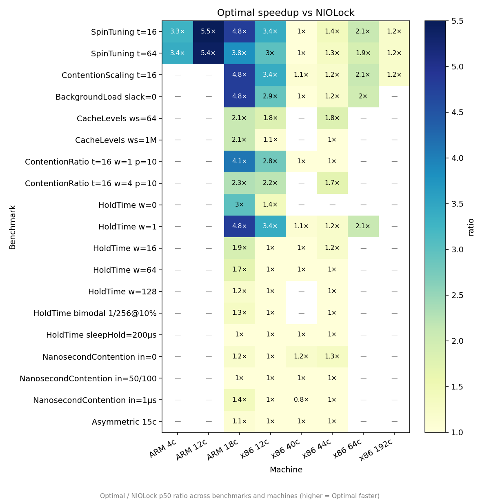
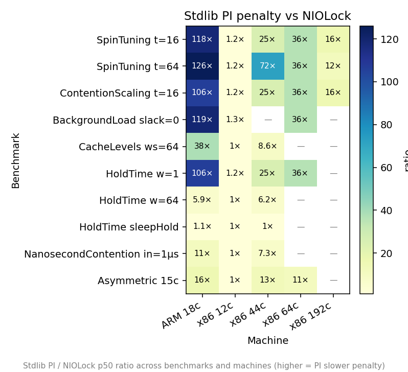

# synchronization-bench

Contention benchmark comparing Swift `Synchronization.Mutex` against `NIOLockedValueBox` (pthread_mutex) on Linux. Demonstrates a performance regression in Swift's stdlib Mutex under contention due to PI-futex (`FUTEX_LOCK_PI`) and an aggressive fixed userspace spin loop.

Prepared as a reproducer for an upstream Swift issue: [Synchronization.Mutex Linux performance](https://github.com/swiftlang/swift).

## The problem

`Synchronization.Mutex` on Linux uses `FUTEX_LOCK_PI` with a 1000-iteration (x86) / 100-iteration (aarch64) fixed spin loop. Under contention, the PI-futex kernel does atomic direct handoff — the lock word transitions `TID_old|WAITERS → TID_new|WAITERS` without ever becoming 0. The spin loop checks `state == 0`, which can never succeed once any thread parks in the kernel. Every spin iteration is wasted. See [Experiments.md](Experiments.md) for the full analysis and [SpinSurvey.md](SpinSurvey.md) for the cross-ecosystem comparison.

## The fix

`OptimalMutex` ([`Sources/MutexBench/OptimalMutex.swift`](Sources/MutexBench/OptimalMutex.swift)) — ~100-line standalone implementation:
- **Plain futex** (`FUTEX_WAIT`/`FUTEX_WAKE`) instead of PI-futex
- **14 iterations** of exponential backoff with regime-gated cap
- Cap adapts to observed lock state each iteration: `state==1` (no waiters) → capHigh=32, `state==2` (waiters parked) → capLow=6

## Implementations compared

| Label | What it is | Futex | Spin |
|---|---|---|---|
| **Optimal** | `OptimalMutex` — proposed replacement | `FUTEX_WAIT`/`FUTEX_WAKE` | 14 iterations, regime-gated backoff |
| **NIOLock** | `NIOLockedValueBox` — `pthread_mutex_t` | `FUTEX_WAIT`/`FUTEX_WAKE` (via glibc) | 0 (park immediately) |
| **Stdlib PI** | `Synchronization.Mutex` — current stdlib | `FUTEX_LOCK_PI` | 1000 × `pause` (x86) / 100 × `wfe` (aarch64) |

On Darwin, all use `os_unfair_lock` — no spin, no PI-futex. The bug is Linux-only.

## Machines tested

| Name | Arch | Cores | CPU | Topology |
|---|---|---:|---|---|
| aarch64 4c | aarch64 | 4 | Apple M4 Pro (Mac Mini) | 4c container VM |
| aarch64 12c | aarch64 | 12 | Apple M4 Pro (Mac Mini) | 12c container VM (all cores) |
| aarch64 18c | aarch64 | 18 | Apple M1 Ultra | 20c host (2-die UltraFusion), 18c container VM |
| x86 12c | x86_64 | 6P/12T | Intel i5-12500 | single die, Hyperthreading |
| x86 40c | x86_64 | 40 | Intel Xeon Gold 6148 | 2-socket NUMA |
| x86 44c | x86_64 | 44 | Intel Xeon E5-2699 v4 | 2-socket NUMA |
| x86 64c | x86_64 | 64 | AMD EPYC 9454P | CCD chiplet (8×8 cores) |
| x86 192c | x86_64 | 192 | Intel Xeon Platinum 8488C | EC2 c7i.metal-48xl, 2-socket HT |
| Docker 4c | x86_64 | 4 | AMD EPYC 9454P | `--cpus=4` on 64c host |

## Workload

Protected state is a `[Int: UInt64]` dictionary with 64 entries. Each lock acquire does one or more map lookup+update operations — mimicking real-world mutex usage (cache state, index updates, shared configuration).

Three parameters control the contention shape:

- **work** — map operations *inside* the lock (critical-section length)
- **pause** — xorshift iterations *outside* the lock between acquires (contention ratio)
- **tasks** — number of concurrent Swift Tasks contending on the lock

## Results: Optimal vs NIOLock

Ratio across all benchmarks and machines (p50 wall clock, tasks=16 unless noted). Values > 1.0× mean Optimal is faster.

| Benchmark | aarch64 4c | aarch64 12c | aarch64 18c | x86 12c | x86 40c | x86 44c | x86 64c | x86 192c |
|---|---:|---:|---:|---:|---:|---:|---:|---:|
| [ContentionScaling](results/ContentionScaling.md) t=16 | 3.3× | 5.5× | 4.8× | 3.4× | ~1× | 1.4× | 2.1× | 1.2× |
| [ContentionScaling](results/ContentionScaling.md) t=64 | 3.4× | 5.4× | 3.8× | 3.0× | ~1× | 1.3× | 1.9× | 1.2× |
| [BackgroundLoad](results/BackgroundLoad.md) slack=0 | — | — | 4.8× | 2.9× | ~1× | 1.2× | 2.0× | 1.2× |
| [CacheLevels](results/CacheLevels.md) ws=64 | — | — | 2.1× | 1.8× | — | 1.8× | — | 1.2× |
| [CacheLevels](results/CacheLevels.md) ws=1M | — | — | 2.1× | 1.1× | — | ~1× | — | 1.1× |
| HoldTime w=1 | — | — | 4.8× | 3.4× | 1.1× | 1.2× | 2.1× | 1.3× |
| HoldTime w=64 | — | — | 1.7× | ~1× | ~1× | ~1× | — | 0.9× |
| NanosecondContention in=0ns | — | — | 1.2× | ~1× | 1.2× | 1.3× | — | 0.8× |
| NanosecondContention in=1µs | — | — | 1.4× | ~1× | 0.8× | ~1× | — | 1.3× |
| Asymmetric 15c | — | — | 1.1× | ~1× | ~1× | ~1× | — | 1.1× |

`~1×` = within 10%. `—` = not tested.

**Optimal wins every short-hold contention benchmark on every machine.** Advantage scales inversely with core count: aarch64 18c (4.8×) > x86 12c (3.4×) > x86 64c (2.1×) > x86 192c (1.2×). Under long holds and sleep-based holds, all implementations converge — lock overhead becomes irrelevant.

## Results: Stdlib PI penalty

| Benchmark | aarch64 18c | x86 12c | x86 44c | x86 64c | x86 192c |
|---|---:|---:|---:|---:|---:|
| ContentionScaling t=16 | 106× | 1.2× | 25× | 36× | 16× |
| BackgroundLoad slack=0 | — | 1.3× | 52× | 36× | — |
| CacheLevels ws=64 | — | ~1× | 8.6× | — | — |
| HoldTime w=1 | 106× | 1.2× | 25× | 36× | — |
| NanosecondContention in=1µs | 11× | ~1× | 7.3× | — | — |

The penalty scales with core count and topology. On x86 44c (2-socket NUMA), BackgroundLoad takes **1,659 ms** vs NIOLock's 32 ms.

## Where Optimal is NOT faster

Optimal matches or slightly trails NIOLock in:
- **Long hold times** (work≥64): critical section dominates
- **Sleep-based holds** (200µs sleep): kernel sleep dominates
- **Zero-nanosecond hold** on x86 192c: pure lock/unlock overhead, any spinning adds cost
- **x86 40c at tasks≥16**: borderline oversubscription

In no case is Optimal more than ~20% slower than NIOLock, and these are all synthetic edge cases.

## Benchmark targets

Ten `package-benchmark` targets, each testing a different axis of mutex behavior.

| Target | What it tests | Based on | Detail |
|---|---|---|---|
| ContentionScaling | Task-count sweep at tight critical section | [Go mutex_test.go](https://github.com/golang/go/blob/master/src/sync/mutex_test.go), folly/abseil | [Results](results/ContentionScaling.md) |
| BackgroundLoad | Scheduler interaction with idle Tasks | [Go BenchmarkMutexSlack](https://github.com/golang/go/blob/master/src/sync/mutex_test.go) | [Results](results/BackgroundLoad.md) |
| CacheLevels | L1 to DRAM working set sweep | Original | [Results](results/CacheLevels.md) |
| HoldTime | Critical section length sweep, bimodal | [matklad](https://matklad.github.io/2020/01/04/mutexes-are-faster-than-spinlocks.html), [WebKit LockSpeedTest](https://webkit.org/blog/6161/locking-in-webkit/) | [Results](results/HoldTime.md) |
| ContentionRatio | Unlocked work between acquires | [Go mutex_test.go](https://github.com/golang/go/blob/master/src/sync/mutex_test.go), [folly SharedMutex](https://github.com/facebook/folly/blob/main/folly/test/SharedMutexTest.cpp) | [Results](results/ContentionRatio.md) |
| NanosecondContention | ns-calibrated delay grid | [abseil BM_Contended](https://github.com/abseil/abseil-cpp/blob/master/absl/synchronization/mutex_benchmark.cc) | [Results](results/NanosecondContention.md) |
| SpinTuning | Spin count x backoff cap grid | Original | [Experiments](Experiments.md) |
| PthreadBench | pthread-based lock-bench compatibility matrix | [matklad/lock-bench](https://github.com/matklad/lock-bench) | Compatibility target |
| Asymmetric | Producer/consumer fairness | [abseil BM_MutexEnqueue](https://github.com/abseil/abseil-cpp/blob/master/absl/synchronization/mutex_benchmark.cc) | [Fairness](results/Fairness.md) |
| LongRun | 60s starvation probe with Gini metric | [Go starvation mode](https://github.com/golang/go/blob/master/src/sync/mutex.go), [WebKit unfairness](https://webkit.org/blog/6161/locking-in-webkit/) | [Results](results/LongRun.md) |
| Bursty | Thundering-herd settling time | [glibc jitter](https://www.gnu.org/software/libc/manual/html_node/POSIX-Thread-Tunables.html), [WebKit burst detection](https://webkit.org/blog/6161/locking-in-webkit/) | [Results](results/Bursty.md) |

## Further reading

- [Fairness.md](results/Fairness.md) - per-acquire latency distributions, barging vs FIFO tradeoff
- [Experiments.md](Experiments.md) - 15 experiments from PI-futex analysis to OptimalMutex
- [SpinSurvey.md](SpinSurvey.md) - cross-ecosystem survey: WebKit, Rust, Go, glibc, Linux kernel
