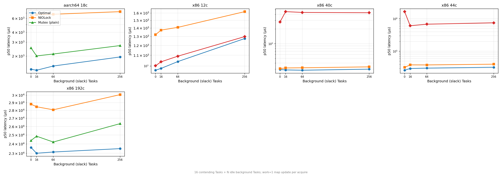

# Background Load

How mutex performance is affected when idle background Tasks compete for scheduler slots alongside lock-contending Tasks. Adapted from [Go `BenchmarkMutexSlack`](https://github.com/golang/go/blob/master/src/sync/mutex_test.go).

## Workload

16 contending Tasks repeatedly acquire a lock (work=1 map update per acquire). M additional background Tasks burn CPU without touching the lock. The `slack` parameter controls how many background Tasks are running.

| Parameter | Values |
|---|---|
| contenders | 16 |
| background tasks (slack) | 0, 16, 64, 256 |
| work per acquire | 1 |

This tests whether the mutex spin strategy fights the Swift cooperative executor for scheduling. If spinning burns CPU that background Tasks or the lock owner needs, performance degrades under load.

## Implementations

| Label | Description |
|---|---|
| **Optimal** | `OptimalMutex` — plain futex, regime-gated backoff |
| **NIOLock** | `NIOLockedValueBox` — `pthread_mutex_t`, park immediately |
| **Stdlib PI** | `Synchronization.Mutex` — PI-futex, 1000/100 fixed spins |

## Optimal vs NIOLock ratio (p50, all machines)

| Slack | aarch64 18c | x86 12c | x86 40c | x86 44c | x86 192c |
|---:|---:|---:|---:|---:|---:|
| 0 | **4.8×** | 1.4× | 1.1× | **1.2×** | **1.2×** |
| 16 | **5.1×** | 1.4× | 1.1× | **1.3×** | **1.2×** |
| 64 | **4.5×** | 1.4× | 1.1× | **1.3×** | **1.2×** |
| 256 | **3.7×** | 1.3× | 1.1× | **1.2×** | **1.3×** |

Optimal is faster than NIOLock at every slack level on every machine.

## Stdlib PI penalty

| Slack | aarch64 18c | x86 12c | x86 40c | x86 44c |
|---:|---|---|---|---|
| 0 | — | ~same | **9× slower** | **52× slower** |
| 16 | — | ~same | **14× slower** | **16× slower** |
| 64 | — | ~same | **14× slower** | **18× slower** |
| 256 | — | ~same | **13× slower** | **19× slower** |

Stdlib PI catastrophically degrades on machines with ≥40 cores. On x86 44c (2-socket NUMA), BackgroundLoad slack=0 takes **1,659 ms** vs NIOLock's 32 ms.

---

## Detailed results

### aarch64 18c (Apple M1 Ultra, 18c container VM)

| Slack | Impl | p50 | p75 | p90 | p99 | p100 | Samples |
|---:|---|---:|---:|---:|---:|---:|---:|
| 0 | **Optimal** | 1,362 | 1,423 | 1,474 | 1,530 | 1,730 | 250 |
| 0 | NIOLock | 6,504 | 6,775 | 7,127 | 7,516 | 8,796 | 250 |
| 0 | PlainFutexMutex (spin=100) | 2,542 | 2,820 | 3,023 | 3,561 | 4,108 | 250 |
| | | | | | | | |
| 16 | **Optimal** | 1,322 | 1,390 | 1,449 | 1,521 | 1,672 | 250 |
| 16 | NIOLock | 6,681 | 6,910 | 7,254 | 7,750 | 8,413 | 250 |
| 16 | PlainFutexMutex (spin=100) | 2,008 | 2,261 | 2,470 | 2,679 | 3,246 | 250 |
| | | | | | | | |
| 64 | **Optimal** | 1,495 | 1,550 | 1,637 | 1,729 | 1,990 | 250 |
| 64 | NIOLock | 6,754 | 7,029 | 7,389 | 7,721 | 10,812 | 250 |
| 64 | PlainFutexMutex (spin=100) | 2,122 | 2,365 | 2,558 | 2,922 | 3,471 | 250 |
| | | | | | | | |
| 256 | **Optimal** | 1,947 | 2,030 | 2,120 | 2,226 | 2,530 | 250 |
| 256 | NIOLock | 7,291 | 7,504 | 7,889 | 9,167 | 18,486 | 250 |
| 256 | PlainFutexMutex (spin=100) | 2,714 | 3,017 | 3,310 | 3,564 | 4,381 | 250 |

**Observations:** Optimal 3.7–5.1× faster than NIOLock across all slack levels. Background load barely affects Optimal (1,362→1,947 µs from slack=0 to slack=256 = 43% increase). NIOLock's tail worsens under load: p100 jumps from 8,796 to 18,486 at slack=256.

---

### x86 12c (Intel i5-12500, 6P/12T HT)

| Slack | Impl | p50 | p75 | p90 | p99 | p100 |
|---:|---|---:|---:|---:|---:|---:|
| 0 | **Optimal** | 963 | 967 | 978 | 1,317 | 1,496 |
| 0 | NIOLock | 1,320 | 1,324 | 1,330 | 1,346 | 1,369 |
| 0 | Stdlib PI | 1,002 | 1,005 | 1,008 | 1,027 | 1,034 |
| | | | | | | |
| 16 | **Optimal** | 979 | 986 | 992 | 1,111 | 1,505 |
| 16 | NIOLock | 1,375 | 1,378 | 1,383 | 1,398 | 1,433 |
| 16 | Stdlib PI | 1,038 | 1,042 | 1,047 | 1,067 | 1,067 |
| | | | | | | |
| 64 | **Optimal** | 1,040 | 1,056 | 1,546 | 1,840 | 1,883 |
| 64 | NIOLock | 1,409 | 1,412 | 1,418 | 1,434 | 1,435 |
| 64 | Stdlib PI | 1,091 | 1,096 | 1,105 | 1,592 | 1,606 |
| | | | | | | |
| 256 | **Optimal** | 1,276 | 1,281 | 1,292 | 1,370 | 1,800 |
| 256 | NIOLock | 1,620 | 1,624 | 1,630 | 1,694 | 1,706 |
| 256 | Stdlib PI | 1,298 | 1,304 | 1,309 | 1,336 | 1,342 |

**Observations:** On 12 cores all implementations are close (6P with HT = heavily oversubscribed at 16 contenders). Optimal is 1.3–1.4× faster than NIOLock. Stdlib PI is competitive on this small machine — no PI cliff. Note the very tight distributions (p50→p99 within 5%).

---

### x86 40c (Intel Xeon Gold 6148, 2-socket NUMA)

| Slack | Impl | p50 | p75 | p90 | p99 | p100 |
|---:|---|---:|---:|---:|---:|---:|
| 0 | **Optimal** | 29,508 | 30,769 | 31,670 | 33,751 | 35,023 |
| 0 | NIOLock | 30,884 | 34,603 | 36,307 | 38,863 | 39,028 |
| 0 | Stdlib PI | **279,970** | **355,467** | **415,236** | **443,896** | **443,896** |
| | | | | | | |
| 16 | **Optimal** | 28,951 | 30,212 | 31,965 | 33,948 | 35,768 |
| 16 | NIOLock | 31,834 | 33,341 | 34,701 | 36,667 | 37,374 |
| 16 | Stdlib PI | **454,296** | **488,374** | **503,841** | **546,366** | **546,366** |
| | | | | | | |
| 64 | **Optimal** | 28,541 | 30,163 | 32,391 | 35,619 | 35,766 |
| 64 | NIOLock | 32,113 | 35,291 | 36,635 | 39,780 | 40,043 |
| 64 | Stdlib PI | **437,780** | **511,705** | **529,793** | **558,402** | **558,402** |
| | | | | | | |
| 256 | **Optimal** | 30,048 | 32,047 | 33,391 | 36,504 | 37,581 |
| 256 | NIOLock | 33,489 | 35,914 | 38,076 | 40,206 | 41,936 |
| 256 | Stdlib PI | **431,489** | **507,773** | **522,977** | **553,586** | **553,586** |

**Observations:** Optimal ~1.1× faster than NIOLock — modest gap on this 40-core machine. Stdlib PI is 9–14× slower than NIOLock. Background load has minimal effect on Optimal or NIOLock, but makes Stdlib PI even worse (279ms→454ms from slack=0 to slack=16).

---

### x86 44c (Intel Xeon E5-2699 v4, 2-socket NUMA)

| Slack | Impl | p50 | p75 | p90 | p99 | p100 |
|---:|---|---:|---:|---:|---:|---:|
| 0 | **Optimal** | 26,149 | 27,771 | 29,458 | 31,982 | 32,143 |
| 0 | NIOLock | 32,080 | 34,275 | 36,536 | 41,452 | 44,084 |
| 0 | Stdlib PI | **1,658,847** | **1,816,134** | **1,876,951** | **1,884,031** | **1,884,031** |
| | | | | | | |
| 16 | **Optimal** | 29,590 | 31,457 | 33,063 | 35,324 | 36,551 |
| 16 | NIOLock | 38,175 | 40,501 | 43,713 | 45,318 | 45,337 |
| 16 | Stdlib PI | **611,844** | **665,846** | **703,070** | **822,752** | **822,752** |
| | | | | | | |
| 64 | **Optimal** | 30,409 | 32,457 | 33,980 | 37,192 | 37,354 |
| 64 | NIOLock | 38,044 | 40,927 | 44,138 | 48,136 | 49,701 |
| 64 | Stdlib PI | **682,099** | **721,420** | **773,849** | **884,573** | **884,573** |
| | | | | | | |
| 256 | **Optimal** | 32,358 | 34,144 | 36,274 | 38,928 | 39,014 |
| 256 | NIOLock | 40,206 | 42,631 | 45,220 | 48,660 | 49,933 |
| 256 | Stdlib PI | **752,353** | **879,231** | **971,506** | **1,146,704** | **1,146,704** |

**Observations:** Optimal 1.2–1.3× faster than NIOLock. Stdlib PI is **52× slower** at slack=0 (1,659 ms vs 32 ms). This 2-socket NUMA machine shows the worst PI penalty: cross-socket PI chain walking under scheduler pressure produces multi-second stalls.

---

### x86 192c (Intel Xeon Platinum 8488C, EC2 c7i.metal-48xl, 2-socket HT)

| Slack | Impl | p50 | p75 | p90 | p99 | p100 | Samples |
|---:|---|---:|---:|---:|---:|---:|---:|
| 0 | **Optimal** | 23,626 | 24,543 | 25,625 | 26,345 | 28,821 | 250 |
| 0 | NIOLock | 28,803 | 36,569 | 39,453 | 40,534 | 41,506 | 250 |
| 0 | PlainFutexMutex (spin=100) | 24,379 | 25,543 | 27,083 | 28,164 | 31,577 | 250 |
| | | | | | | | |
| 16 | **Optimal** | 23,003 | 24,216 | 25,952 | 26,919 | 30,734 | 250 |
| 16 | NIOLock | 28,459 | 30,081 | 39,649 | 42,074 | 43,958 | 250 |
| 16 | PlainFutexMutex (spin=100) | 24,871 | 26,247 | 28,213 | 29,475 | 33,505 | 250 |
| | | | | | | | |
| 64 | **Optimal** | 23,134 | 24,478 | 25,936 | 26,821 | 31,973 | 250 |
| 64 | NIOLock | 28,066 | 30,458 | 40,042 | 41,648 | 43,942 | 250 |
| 64 | PlainFutexMutex (spin=100) | 24,216 | 25,657 | 27,509 | 29,409 | 36,802 | 250 |
| | | | | | | | |
| 256 | **Optimal** | 23,495 | 25,248 | 27,312 | 28,819 | 32,315 | 250 |
| 256 | NIOLock | 30,081 | 36,831 | 41,189 | 42,500 | 44,706 | 250 |
| 256 | PlainFutexMutex (spin=100) | 26,345 | 27,935 | 29,016 | 30,720 | 36,420 | 250 |

**Observations:** Optimal 1.2–1.3× faster than NIOLock. NIOLock has a wide p50→p90 spread on this machine (28→40 ms at slack=16), while Optimal stays tight (23→26 ms). Background load barely affects Optimal — regime-gated backoff adapts to scheduler pressure naturally.

---

## Key findings

1. **Optimal handles background load gracefully.** On aarch64 18c, going from slack=0 to slack=256 increases Optimal latency by only 43% (1,362→1,947 µs). NIOLock increases by 12% but from a much higher base. Optimal's regime-gated backoff naturally reduces CPU pressure when the scheduler is loaded.

2. **Stdlib PI collapses under background load on multi-socket machines.** On x86 44c at slack=0, Stdlib PI takes 1,659 ms — 52× slower than NIOLock. Background Tasks compete with PI chain walking for scheduler slots, amplifying the PI-futex overhead.

3. **NIOLock's tail worsens under load.** On x86 192c, NIOLock's p90 jumps from 36 ms (slack=0) to 41 ms (slack=256) while Optimal stays at 25–27 ms. The park-immediately strategy means every contended acquire goes through the kernel, and kernel wake latency increases under scheduler pressure.

4. **On small machines (x86 12c), everything converges.** With only 6 physical cores and 16 contenders + 256 background Tasks, the system is so oversubscribed that mutex strategy differences are dwarfed by scheduling jitter.
