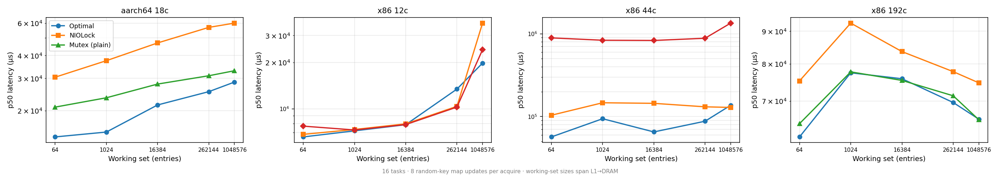

# Cache Levels

How mutex performance varies when the protected data spans different cache hierarchy levels — from L1 to DRAM.

## Workload

16 contending Tasks, each acquiring the lock and performing 8 random-key map updates. The map capacity (working set) varies to push the critical section through L1, L2, L3, and into DRAM. Random keys defeat the hardware prefetcher — each access inside the critical section is a potential cache miss.

| Parameter | Values | Expected cache level |
|---|---|---|
| ws=64 | 64 entries (~2 KB) | L1 |
| ws=1024 | 1,024 entries (~32 KB) | L2 |
| ws=16384 | 16,384 entries (~512 KB) | L2/L3 boundary |
| ws=262144 | 262,144 entries (~8 MB) | L3 |
| ws=1048576 | 1,048,576 entries (~32 MB) | DRAM |

All tests: tasks=16, work=8, pause=0.

## Implementations

| Label | Description |
|---|---|
| **Optimal** | `OptimalMutex` — plain futex, regime-gated backoff |
| **NIOLock** | `NIOLockedValueBox` — `pthread_mutex_t`, park immediately |
| **Stdlib PI** | `Synchronization.Mutex` — PI-futex, fixed spins |
| **PlainFutexMutex (spin=100)** | `PlainFutexMutex` spin=100 - plain futex, fixed spin, no backoff. Not the stdlib - "(plain)" refers to plain futex vs PI-futex. |

## Optimal vs NIOLock ratio (p50, all machines)

| Working set | aarch64 18c | x86 12c | x86 44c | x86 192c |
|---|---:|---:|---:|---:|
| ws=64 (L1) | **2.1×** | ~1× | **1.8×** | **1.2×** |
| ws=1024 (L2) | **2.5×** | ~1× | **1.6×** | **1.2×** |
| ws=16384 (L2/L3) | **2.2×** | ~1× | **2.2×** | **1.1×** |
| ws=262144 (L3) | **2.2×** | 0.8× | **1.5×** | **1.1×** |
| ws=1048576 (DRAM) | **2.1×** | **1.8×** | ~1× | **1.1×** |

Optimal wins at every cache level on aarch64 18c and x86 192c. On x86 12c, results converge (small machine, all implementations similar). On x86 44c, Optimal advantage is largest at L1-L3 and narrows at DRAM.

## Stdlib PI penalty

| Working set | aarch64 18c | x86 12c | x86 44c |
|---|---|---|---|
| ws=64 (L1) | — | ~1× | **14× slower** |
| ws=1024 (L2) | — | ~1× | **6.5× slower** |
| ws=16384 (L2/L3) | — | ~1× | **5.8× slower** |
| ws=262144 (L3) | — | ~1× | **6.7× slower** |
| ws=1048576 (DRAM) | — | ~1× | **10× slower** |

On x86 44c (2-socket NUMA), Stdlib PI is 6–14× slower across all cache levels. The PI overhead is not masked by cache stalls — it dominates regardless of whether the critical section is compute-bound or memory-bound.

---

## Detailed results

### aarch64 18c (Apple M1 Ultra, 18c container VM)

| Working set | Impl | p50 | p75 | p90 | p99 | p100 | Samples |
|---|---|---:|---:|---:|---:|---:|---:|
| ws=64 (L1) | **Optimal** | 14,369 | 15,008 | 15,835 | 16,400 | 18,399 | 250 |
| ws=64 | NIOLock | 30,458 | 30,949 | 31,916 | 32,391 | 33,285 | 250 |
| ws=64 | PlainFutexMutex (spin=100) | 20,906 | 21,398 | 22,004 | 22,462 | 24,677 | 250 |
| | | | | | | | |
| ws=1024 (L2) | **Optimal** | 15,278 | 15,639 | 16,187 | 16,597 | 18,218 | 250 |
| ws=1024 | NIOLock | 37,487 | 38,044 | 38,666 | 39,322 | 39,973 | 250 |
| ws=1024 | PlainFutexMutex (spin=100) | 23,511 | 23,855 | 24,248 | 24,887 | 26,117 | 250 |
| | | | | | | | |
| ws=16384 (L2/L3) | **Optimal** | 21,479 | 21,873 | 22,282 | 22,790 | 23,874 | 250 |
| ws=16384 | NIOLock | 46,858 | 47,514 | 48,300 | 49,086 | 50,171 | 250 |
| ws=16384 | PlainFutexMutex (spin=100) | 27,935 | 28,295 | 28,803 | 29,622 | 31,251 | 250 |
| | | | | | | | |
| ws=262144 (L3) | **Optimal** | 25,395 | 25,919 | 26,821 | 28,131 | 29,652 | 250 |
| ws=262144 | NIOLock | 56,984 | 58,262 | 59,245 | 59,834 | 60,680 | 250 |
| ws=262144 | PlainFutexMutex (spin=100) | 31,015 | 31,261 | 31,539 | 31,965 | 35,110 | 250 |
| | | | | | | | |
| ws=1048576 (DRAM) | **Optimal** | 28,639 | 29,000 | 29,606 | 30,458 | 31,705 | 250 |
| ws=1048576 | NIOLock | 60,129 | 61,309 | 62,521 | 63,504 | 65,927 | 250 |
| ws=1048576 | PlainFutexMutex (spin=100) | 33,030 | 33,276 | 33,718 | 34,439 | 36,076 | 250 |

**Observations:** Optimal is 2.1–2.5× faster than NIOLock at every cache level. The advantage is remarkably consistent — no cache-level dependence. Optimal's tight distributions (p50→p99 within 12%) indicate the regime-gated backoff works well regardless of whether the critical section is hitting L1 or DRAM.

---

### x86 12c (Intel i5-12500, 6P/12T HT)

| Working set | Impl | p50 | p75 | p90 | p99 | p100 |
|---|---|---:|---:|---:|---:|---:|
| ws=64 (L1) | **Optimal** | 6,554 | 6,566 | 6,627 | 8,229 | 8,903 |
| ws=64 | NIOLock | 6,812 | 6,820 | 6,828 | 6,853 | 6,858 |
| ws=64 | Stdlib PI | 7,705 | 7,725 | 7,799 | 9,535 | 10,354 |
| | | | | | | |
| ws=1024 (L2) | **Optimal** | 7,180 | 7,258 | 7,451 | 10,191 | 10,232 |
| ws=1024 | NIOLock | 7,328 | 7,504 | 7,565 | 9,576 | 10,721 |
| ws=1024 | Stdlib PI | 7,274 | 7,389 | 7,635 | 11,190 | 11,192 |
| | | | | | | |
| ws=16384 (L2/L3) | Optimal | 7,873 | 7,909 | 7,950 | 10,289 | 11,272 |
| ws=16384 | NIOLock | 7,975 | 8,016 | 8,061 | 10,207 | 11,032 |
| ws=16384 | Stdlib PI | 7,889 | 7,926 | 8,069 | 10,150 | 11,308 |
| | | | | | | |
| ws=262144 (L3) | Optimal | 13,435 | 13,918 | 13,992 | 14,434 | 14,877 |
| ws=262144 | NIOLock | 10,371 | 10,404 | 10,494 | 15,065 | 19,266 |
| ws=262144 | Stdlib PI | 10,256 | 10,289 | 10,363 | 12,771 | 13,543 |
| | | | | | | |
| ws=1048576 (DRAM) | **Optimal** | 19,841 | 19,890 | 20,103 | 21,823 | 22,063 |
| ws=1048576 | NIOLock | 36,143 | 36,340 | 36,471 | 36,667 | 37,542 |
| ws=1048576 | Stdlib PI | 24,265 | 31,031 | 37,421 | 67,371 | 67,728 |

**Observations:** On 12 cores, L1–L3 results converge across all implementations (~7–8 ms). The lock overhead is small relative to the critical section. At DRAM (ws=1M), Optimal pulls ahead at 1.8× faster than NIOLock. Stdlib PI has a nasty tail at DRAM: p99=67ms (bimodal). At L3 (ws=262144), Optimal is slightly slower than NIOLock — the spinning overhead exceeds the benefit when the critical section involves L3 cache misses on this small machine.

---

### x86 44c (Intel Xeon E5-2699 v4, 2-socket NUMA)

| Working set | Impl | p50 | p75 | p90 | p99 | p100 |
|---|---|---:|---:|---:|---:|---:|
| ws=64 (L1) | **Optimal** | 56,689 | 63,373 | 71,959 | 93,782 | 94,788 |
| ws=64 | NIOLock | 103,678 | 115,999 | 125,829 | 138,805 | 140,870 |
| ws=64 | Stdlib PI | **891,814** | **1,104,151** | **1,225,785** | **2,064,176** | **2,064,176** |
| | | | | | | |
| ws=1024 (L2) | **Optimal** | 94,044 | 107,545 | 111,477 | 115,933 | 117,123 |
| ws=1024 | NIOLock | 146,670 | 158,335 | 165,413 | 175,243 | 175,251 |
| ws=1024 | Stdlib PI | **835,191** | **947,388** | **1,007,157** | **1,558,314** | **1,558,314** |
| | | | | | | |
| ws=16384 (L2/L3) | **Optimal** | 65,143 | 71,696 | 89,129 | 106,627 | 123,098 |
| ws=16384 | NIOLock | 144,310 | 156,893 | 164,758 | 168,821 | 169,681 |
| ws=16384 | Stdlib PI | **829,948** | **997,720** | **1,058,013** | **1,783,167** | **1,783,167** |
| | | | | | | |
| ws=262144 (L3) | **Optimal** | 87,753 | 97,255 | 108,593 | 140,640 | 145,858 |
| ws=262144 | NIOLock | 131,006 | 155,320 | 164,495 | 172,884 | 180,796 |
| ws=262144 | Stdlib PI | **882,901** | **955,253** | **1,038,090** | **1,952,904** | **1,952,904** |
| | | | | | | |
| ws=1048576 (DRAM) | Optimal | 136,708 | 145,359 | 153,223 | 229,623 | 229,623 |
| ws=1048576 | NIOLock | 128,778 | 149,684 | 158,728 | 198,371 | 198,371 |
| ws=1048576 | Stdlib PI | **1,345,323** | **1,716,519** | **1,996,489** | **2,159,887** | **2,159,887** |

**Observations:** On 2-socket NUMA, Optimal is 1.5–2.2× faster than NIOLock from L1 through L3. At DRAM, NIOLock slightly edges Optimal (129ms vs 137ms) — the critical section is so long that parking immediately is more efficient than spinning. Stdlib PI is catastrophic at every cache level: 830ms–1,345ms (6–14× slower than NIOLock). The PI overhead dominates regardless of memory access pattern.

---

### x86 192c (Intel Xeon Platinum 8488C, EC2 c7i.metal-48xl, 2-socket HT)

| Working set | Impl | p50 | p75 | p90 | p99 | p100 | Samples |
|---|---|---:|---:|---:|---:|---:|---:|
| ws=64 (L1) | **Optimal** | 61,473 | 64,487 | 67,371 | 69,272 | 71,101 | 250 |
| ws=64 | NIOLock | 75,235 | 76,415 | 83,231 | 88,146 | 90,577 | 250 |
| ws=64 | PlainFutexMutex (spin=100) | 64,487 | 67,011 | 69,206 | 71,041 | 73,576 | 250 |
| | | | | | | | |
| ws=1024 (L2) | **Optimal** | 77,464 | 80,675 | 84,279 | 85,787 | 88,290 | 250 |
| ws=1024 | NIOLock | 92,668 | 94,372 | 96,862 | 99,680 | 106,823 | 250 |
| ws=1024 | PlainFutexMutex (spin=100) | 77,726 | 81,068 | 83,886 | 87,163 | 89,364 | 250 |
| | | | | | | | |
| ws=16384 (L2/L3) | **Optimal** | 75,825 | 78,250 | 80,675 | 81,789 | 83,256 | 250 |
| ws=16384 | NIOLock | 83,624 | 85,197 | 94,306 | 99,222 | 101,907 | 250 |
| ws=16384 | PlainFutexMutex (spin=100) | 75,366 | 77,922 | 80,478 | 82,838 | 86,203 | 250 |
| | | | | | | | |
| ws=262144 (L3) | **Optimal** | 69,599 | 71,303 | 73,204 | 74,777 | 79,013 | 250 |
| ws=262144 | NIOLock | 77,791 | 80,675 | 90,767 | 93,454 | 96,030 | 250 |
| ws=262144 | PlainFutexMutex (spin=100) | 71,303 | 73,728 | 76,022 | 78,512 | 82,839 | 250 |
| | | | | | | | |
| ws=1048576 (DRAM) | **Optimal** | 65,536 | 67,699 | 69,206 | 70,451 | 71,640 | 250 |
| ws=1048576 | NIOLock | 74,711 | 78,905 | 85,197 | 89,457 | 92,613 | 250 |
| ws=1048576 | PlainFutexMutex (spin=100) | 65,405 | 67,043 | 69,272 | 70,975 | 73,715 | 250 |

**Observations:** Optimal 1.1–1.2× faster than NIOLock across all cache levels. Consistent advantage even at DRAM. NIOLock has wider tails: p50=83,624 but p90=94,306 at ws=16384 (13% spread vs Optimal's 6%). Interesting: ws=1048576 (DRAM) is actually faster than ws=1024 (L2) on this machine — likely due to DRAM's higher bandwidth compensating for latency when the working set exceeds L3.

---

## Key findings

1. **Optimal wins at every cache level on aarch64 and x86 192c.** The advantage is consistent (2.1–2.5× on aarch64, 1.1–1.2× on x86 192c) regardless of whether the critical section is L1-bound or DRAM-bound.

2. **Cache level doesn't change the mutex ranking.** If Optimal is faster than NIOLock at L1, it's faster at DRAM too. The lock strategy dominates the critical section's cache behavior. This means the optimization is safe — it won't regress on memory-intensive workloads.

3. **Stdlib PI is catastrophic regardless of cache level.** On x86 44c (NUMA), PI is 6–14× slower from L1 through DRAM. The PI-futex kernel overhead is not masked by cache stalls.

4. **On small machines (x86 12c), implementations converge at L1-L3.** Only at DRAM (ws=1M) does Optimal pull ahead (1.8×). The critical section time at smaller working sets is too short to differentiate lock strategies.

5. **DRAM working sets can be faster than L2/L3.** On x86 192c, ws=1M is faster than ws=1024. This is counterintuitive but explained by DRAM bandwidth vs L3 contention — with 16 tasks hitting the same L3 cache set, the L3 becomes a bottleneck. DRAM's higher aggregate bandwidth avoids this.
