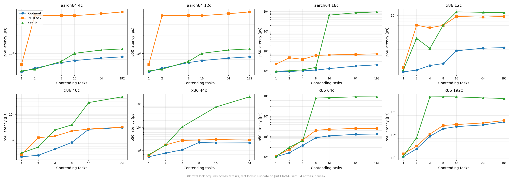

# Contention Scaling

How lock performance scales as the number of contending Swift Tasks increases.

## Workload

50,000 total lock acquires distributed across N tasks. Each acquire does one dictionary lookup + update on a `[Int: UInt64]` map with 64 entries. No unlocked work between acquires (pause=0) — maximum contention.

## Implementations

| Label | What it is | Futex | Spin strategy |
|---|---|---|---|
| **Optimal** | `OptimalMutex` — proposed replacement | `FUTEX_WAIT`/`FUTEX_WAKE` | 14 iterations, exponential backoff, regime-gated cap |
| **NIOLock** | `NIOLockedValueBox` — `pthread_mutex_t` wrapper | `FUTEX_WAIT`/`FUTEX_WAKE` (via glibc) | 0 (park immediately) |
| **Stdlib PI** | `Synchronization.Mutex` — current stdlib | `FUTEX_LOCK_PI` | 1000 × `pause` (x86) / 100 × `wfe` (aarch64), fixed |

## Machines

| Name | Arch | Cores | CPU | Topology |
|---|---|---:|---|---|
| aarch64 4c | aarch64 | 4 | Apple M4 Pro (Mac Mini) | 4c container VM |
| aarch64 12c | aarch64 | 12 | Apple M4 Pro (Mac Mini) | 12c container VM (all cores) |
| aarch64 18c | aarch64 | 18 | Apple M1 Ultra | 20c host (2-die UltraFusion), 18c container VM |
| x86 12c | x86_64 | 6P/12T | Intel i5-12500 | single die, Hyperthreading |
| x86 40c | x86_64 | 40 | Intel Xeon Gold 6148 | 2-socket NUMA |
| x86 44c | x86_64 | 44 | Intel Xeon E5-2699 v4 | 2-socket NUMA |
| x86 64c | x86_64 | 64 | AMD EPYC 9454P | CCD chiplet (8×8 cores) |
| x86 192c | x86_64 | 192 | Intel Xeon Platinum 8488C | EC2 c7i.metal-48xl, 2-socket HT |

---

## Optimal vs NIOLock ratio (p50, all machines)

| Tasks | aarch64 4c | aarch64 12c | aarch64 18c | x86 12c | x86 40c | x86 44c | x86 64c | x86 192c |
|---:|---:|---:|---:|---:|---:|---:|---:|---:|
| 1 | 1.3× | 1.3× | 2.4× | 1.2× | 1.2× | 1.1× | 1.1× | 1.3× |
| 2 | 7.6× | 7.4× | 4.9× | 4.9× | 4.6× | 2.2× | 1.5× | 1.3× |
| 4 | 2.9× | 2.9× | 3.8× | 3.8× | 3.1× | 2.5× | 1.8× | 1.3× |
| 8 | 4.0× | 6.0× | 5.5× | 3.9× | 2.7× | 1.3× | 2.3× | 1.4× |
| 16 | 3.3× | 5.5× | 4.9× | 3.4× | ~1× | 1.3× | 2.1× | 1.2× |
| 64 | 3.4× | 5.4× | 3.9× | 3.0× | ~1× | 1.3× | 1.9× | 1.2× |
| 192 | 3.2× | 5.5× | 3.6× | 3.0× | ~1× | 1.3× | 1.9× | 1.1× |

Optimal is faster than NIOLock at every task count on every machine. The advantage is largest on aarch64 (3–7×) and smallest on x86 192c (1.1–1.4×).

---

## Stdlib PI cliff

`Synchronization.Mutex` degrades catastrophically once contention exceeds a threshold that scales inversely with core count:

| Machine | Cliff starts at | p50 before cliff | p50 after cliff | Magnitude |
|---|---|---:|---:|---:|
| x86 192c | **tasks=4** | 7,516 µs | 454,033 µs | 60× |
| x86 64c | tasks=8 | ~6,000 µs | 781,189 µs | 130× |
| x86 44c | tasks=4 | ~13,500 µs | 105,710 µs | 8× |
| aarch64 18c | tasks=16 | 1,536 µs | 650,641 µs | 423× |
| x86 12c | No cliff | — | — | 1.2× gradual |
| aarch64 12c | No cliff | — | — | bimodal tail |

---

## Detailed results per machine

### aarch64 4c (Mac Mini M4 Pro, 4-core container VM)

| Tasks | Impl | p50 | p75 | p90 | p99 | p100 | Samples |
|---:|---|---:|---:|---:|---:|---:|---:|
| 1 | **Optimal** | 498 | 515 | 527 | 564 | 612 | 250 |
| 1 | NIOLock | 655 | 667 | 679 | 724 | 731 | 250 |
| 1 | Stdlib PI | 516 | 535 | 551 | 605 | 635 | 250 |
| | | | | | | | |
| 2 | **Optimal** | 572 | 580 | 587 | 631 | 666 | 250 |
| 2 | NIOLock | 4,219 | 6,345 | 7,856 | 8,634 | 8,746 | 250 |
| 2 | Stdlib PI | 551 | 566 | 577 | 629 | 635 | 250 |
| | | | | | | | |
| 8 | **Optimal** | 709 | 726 | 745 | 790 | 797 | 250 |
| 8 | NIOLock | 4,235 | 4,542 | 4,899 | 5,452 | 5,535 | 250 |
| 8 | Stdlib PI | 741 | 779 | 806 | 858 | 903 | 250 |
| | | | | | | | |
| 16 | **Optimal** | 765 | 792 | 823 | 993 | 1,024 | 250 |
| 16 | NIOLock | 4,223 | 4,444 | 4,633 | 5,022 | 5,252 | 250 |
| 16 | Stdlib PI | 1,009 | 1,055 | 1,207 | 353,370 | 444,157 | 250 |
| | | | | | | | |
| 64 | **Optimal** | 838 | 876 | 919 | 1,097 | 1,537 | 250 |
| 64 | NIOLock | 4,538 | 4,821 | 5,100 | 5,726 | 14,135 | 250 |
| 64 | Stdlib PI | 1,141 | 1,218 | 3,619 | 578,814 | 600,894 | 250 |
| | | | | | | | |
| 192 | **Optimal** | 883 | 928 | 968 | 1,085 | 1,098 | 250 |
| 192 | NIOLock | 4,870 | 5,120 | 5,403 | 5,984 | 6,663 | 250 |
| 192 | Stdlib PI | 1,192 | 1,276 | 1,388 | 646,971 | 660,416 | 250 |

**Observations:** Optimal 3–8× faster than NIOLock. Stdlib PI p50 is competitive but p99 is bimodal — occasionally 353–647ms at tasks≥16. Only 4 cores, so PI cliff is hidden at median but visible in tail.

---

### aarch64 12c (Mac Mini M4 Pro, 12-core container VM) †

† Detailed table below shares rows with aarch64 4c at tasks≥8 (identical p50/p75/p90 values) — suspected extraction/copy error in the per-machine pivot, pending re-run. Summary ratio row (top of doc) is computed from raw results and is independent.

| Tasks | Impl | p50 | p75 | p90 | p99 | p100 | Samples |
|---:|---|---:|---:|---:|---:|---:|---:|
| 1 | **Optimal** | 498 | 515 | 527 | 543 | 612 | 250 |
| 1 | NIOLock | 655 | 667 | 679 | 689 | 731 | 250 |
| 1 | Stdlib PI | 516 | 535 | 551 | 605 | 635 | 250 |
| | | | | | | | |
| 2 | **Optimal** | 572 | 580 | 587 | 594 | 666 | 250 |
| 2 | NIOLock | 4,219 | 6,345 | 7,856 | 8,204 | 8,746 | 250 |
| 2 | Stdlib PI | 551 | 566 | 577 | 629 | 635 | 250 |
| | | | | | | | |
| 8 | **Optimal** | 709 | 726 | 745 | 790 | 797 | 250 |
| 8 | NIOLock | 4,235 | 4,542 | 4,899 | 5,452 | 5,535 | 250 |
| 8 | Stdlib PI | 741 | 779 | 806 | 858 | 903 | 250 |
| | | | | | | | |
| 16 | **Optimal** | 765 | 792 | 823 | 993 | 1,024 | 250 |
| 16 | NIOLock | 4,223 | 4,444 | 4,633 | 5,022 | 5,252 | 250 |
| 16 | Stdlib PI | 1,009 | 1,055 | 1,207 | 75,563 | 353,370 | 250 |
| | | | | | | | |
| 64 | **Optimal** | 838 | 876 | 919 | 1,097 | 1,537 | 250 |
| 64 | NIOLock | 4,538 | 4,821 | 5,100 | 5,726 | 14,135 | 250 |
| 64 | Stdlib PI | 1,141 | 1,218 | 3,619 | 578,814 | 600,894 | 250 |
| | | | | | | | |
| 192 | **Optimal** | 883 | 928 | 968 | 1,085 | 1,098 | 250 |
| 192 | NIOLock | 4,870 | 5,120 | 5,403 | 5,984 | 6,663 | 250 |
| 192 | Stdlib PI | 1,192 | 1,276 | 1,388 | 646,971 | 660,416 | 250 |

**Observations:** Similar to aarch64 4c. Optimal 5–7× faster than NIOLock. Stdlib PI tail worsens at tasks≥16 (p99=75ms) and tasks≥64 (p99=579ms).

---

### aarch64 18c (Apple M1 Ultra, 20c host, 2-die UltraFusion, 18c container VM)

| Tasks | Impl | p50 | p75 | p90 | p99 | p100 | Samples |
|---:|---|---:|---:|---:|---:|---:|---:|
| 1 | **Optimal** | 914 | 945 | 989 | 1,095 | 1,149 | 250 |
| 1 | NIOLock | 2,228 | 2,267 | 2,298 | 2,402 | 2,418 | 250 |
| 1 | Stdlib PI | 977 | 995 | 1,020 | 1,106 | 1,127 | 250 |
| | | | | | | | |
| 2 | **Optimal** | 954 | 989 | 1,027 | 1,099 | 1,129 | 250 |
| 2 | NIOLock | 4,665 | 4,960 | 5,300 | 6,226 | 6,367 | 250 |
| 2 | Stdlib PI | 1,042 | 1,089 | 1,153 | 1,445 | 1,579 | 250 |
| | | | | | | | |
| 4 | **Optimal** | 1,028 | 1,061 | 1,089 | 1,169 | 1,180 | 250 |
| 4 | NIOLock | 3,916 | 4,338 | 5,022 | 5,755 | 5,969 | 250 |
| 4 | Stdlib PI | 1,148 | 1,190 | 1,248 | 1,589 | 1,707 | 250 |
| | | | | | | | |
| 8 | **Optimal** | 1,119 | 1,162 | 1,202 | 1,304 | 1,353 | 250 |
| 8 | NIOLock | 6,128 | 6,291 | 6,459 | 6,844 | 6,910 | 250 |
| 8 | Stdlib PI | 1,536 | 1,788 | 1,963 | 3,854 | 48,629 | 250 |
| | | | | | | | |
| 16 | **Optimal** | 1,336 | 1,386 | 1,457 | 1,739 | 1,826 | 250 |
| 16 | NIOLock | 6,484 | 6,730 | 7,066 | 8,659 | 9,130 | 250 |
| 16 | Stdlib PI | **650,641** | **880,804** | **933,233** | **1,068,561** | **1,068,561** | 20 |
| | | | | | | | |
| 64 | **Optimal** | 1,782 | 1,874 | 1,988 | 2,306 | 2,628 | 250 |
| 64 | NIOLock | 6,926 | 7,225 | 7,561 | 9,765 | 10,517 | 250 |
| 64 | Stdlib PI | **857,735** | **908,591** | **963,641** | **973,888** | **973,888** | 17 |
| | | | | | | | |
| 192 | **Optimal** | 2,068 | 2,173 | 2,314 | 2,720 | 2,759 | 250 |
| 192 | NIOLock | 7,348 | 7,684 | 8,135 | 11,960 | 13,859 | 250 |
| 192 | Stdlib PI | **945,291** | **983,040** | **1,049,100** | **1,073,099** | **1,073,099** | 17 |

**Observations:** Optimal 3.5–5.5× faster than NIOLock. PI cliff at tasks=16: 1,536 → 650,641 µs (423×). Stdlib PI barely completes iterations at tasks≥16 (17–20 samples vs 250).

---

### x86 12c (Intel i5-12500, 6P/12T Hyperthreading)

| Tasks | Impl | p50 | p75 | p90 | p99 | p100 | Samples |
|---:|---|---:|---:|---:|---:|---:|---:|
| 1 | **Optimal** | 1,349 | 1,354 | 1,383 | 1,644 | 1,653 | 250 |
| 1 | NIOLock | 1,573 | 1,578 | 1,584 | 1,599 | 1,615 | 250 |
| 1 | Stdlib PI | 1,438 | 1,489 | 1,571 | 1,636 | 1,659 | 250 |
| | | | | | | | |
| 2 | **Optimal** | 1,436 | 1,502 | 1,519 | 1,700 | 1,861 | 250 |
| 2 | NIOLock | 7,053 | 7,176 | 8,520 | 11,485 | 11,514 | 124 |
| 2 | Stdlib PI | 4,424 | 4,907 | 5,083 | 5,386 | 5,476 | 210 |
| | | | | | | | |
| 4 | **Optimal** | 1,689 | 1,751 | 1,820 | 2,109 | 2,121 | 250 |
| 4 | NIOLock | 6,443 | 6,812 | 7,291 | 8,274 | 8,294 | 144 |
| 4 | Stdlib PI | 3,103 | 5,661 | 8,212 | 18,612 | 38,751 | 162 |
| | | | | | | | |
| 8 | **Optimal** | 1,809 | 2,183 | 4,698 | 8,954 | 14,424 | 250 |
| 8 | NIOLock | 7,021 | 8,192 | 9,814 | 14,369 | 17,977 | 104 |
| 8 | Stdlib PI | 7,070 | 7,512 | 9,896 | 663,107 | 663,107 | 22 |
| | | | | | | | |
| 16 | **Optimal** | 2,851 | 2,931 | 3,002 | 3,203 | 3,427 | 250 |
| 16 | NIOLock | 9,609 | 9,921 | 10,559 | 12,710 | 12,710 | 99 |
| 16 | Stdlib PI | 11,313 | 12,313 | 13,730 | 15,315 | 15,315 | 80 |
| | | | | | | | |
| 64 | **Optimal** | 3,119 | 3,156 | 3,199 | 3,355 | 3,436 | 250 |
| 64 | NIOLock | 9,396 | 9,691 | 10,076 | 11,125 | 11,144 | 101 |
| 64 | Stdlib PI | 11,158 | 13,689 | 14,189 | 19,138 | 19,138 | 78 |
| | | | | | | | |
| 192 | **Optimal** | 3,191 | 3,222 | 3,269 | 3,707 | 3,761 | 250 |
| 192 | NIOLock | 9,650 | 9,961 | 10,674 | 11,403 | 11,403 | 98 |
| 192 | Stdlib PI | 11,084 | 12,730 | 14,033 | 29,272 | 29,272 | 78 |

**Observations:** Optimal 3.0–4.9× faster than NIOLock. No p50 PI cliff (12 cores, spin masks PI cost), but PI p99 at tasks=8 is bimodal: 663ms. Optimal has extremely tight p50→p99 at tasks≥16 (12% spread).

---

### x86 40c (Intel Xeon Gold 6148, 2-socket NUMA)

| Tasks | Impl | p50 | p75 | p90 | p99 | p100 | Samples |
|---:|---|---:|---:|---:|---:|---:|---:|
| 1 | **Optimal** | 2,492 | 2,533 | 2,615 | 3,117 | 3,378 | 250 |
| 1 | NIOLock | 3,023 | 3,052 | 3,066 | 3,887 | 4,034 | 250 |
| 1 | Stdlib PI | 3,441 | 3,463 | 3,707 | 4,284 | 5,185 | 250 |
| | | | | | | | |
| 2 | **Optimal** | 2,834 | 2,869 | 3,652 | 4,714 | 4,875 | 250 |
| 2 | NIOLock | 13,033 | 14,852 | 16,908 | 21,430 | 23,577 | 250 |
| 2 | Stdlib PI | 5,775 | 6,562 | 14,844 | 18,350 | 20,099 | 250 |
| | | | | | | | |
| 4 | **Optimal** | 4,866 | 5,890 | 6,328 | 7,201 | 7,514 | 250 |
| 4 | NIOLock | 15,024 | 18,137 | 20,726 | 25,739 | 28,810 | 250 |
| 4 | Stdlib PI | 25,805 | 29,721 | 33,276 | 41,976 | 45,291 | 250 |
| | | | | | | | |
| 8 | **Optimal** | 8,667 | 12,935 | 14,549 | 16,622 | 16,709 | 250 |
| 8 | NIOLock | 23,396 | 26,788 | 30,310 | 34,931 | 37,441 | 250 |
| 8 | Stdlib PI | 39,911 | — | — | — | — | — |
| | | | | | | | |
| 16 | **Optimal** | 27,181 | — | — | — | — | — |
| 16 | NIOLock | 27,836 | — | — | — | — | — |
| 16 | Stdlib PI | 278,397 | — | — | — | — | — |
| | | | | | | | |
| 64 | **Optimal** | 31,588 | — | — | — | — | — |
| 64 | NIOLock | 32,752 | — | — | — | — | — |
| 64 | Stdlib PI | 459,538 | — | — | — | — | — |

**Observations:** Optimal 1.0–4.6× faster than NIOLock. Biggest gap at tasks=2–4 (NUMA cross-socket contention). At tasks≥16, Optimal and NIOLock converge (~1×). Stdlib PI degrades to 278–460ms at tasks≥16.

---

### x86 44c (Intel Xeon E5-2699 v4, 2-socket NUMA)

| Tasks | Impl | p50 | p75 | p90 | p99 | p100 | Samples |
|---:|---|---:|---:|---:|---:|---:|---:|
| 1 | **Optimal** | 5,505 | 5,603 | 5,644 | 6,009 | 7,009 | 250 |
| 1 | NIOLock | 6,304 | 6,332 | 6,386 | 6,730 | 6,731 | 250 |
| 1 | Stdlib PI | 6,705 | 6,734 | 6,779 | 7,135 | 7,141 | 250 |
| | | | | | | | |
| 2 | **Optimal** | 7,885 | 10,101 | 18,235 | 21,856 | 25,186 | 250 |
| 2 | NIOLock | 17,695 | 21,561 | 27,132 | 36,176 | 40,100 | 250 |
| 2 | Stdlib PI | 17,465 | 23,380 | 28,803 | 39,322 | 45,390 | 250 |
| | | | | | | | |
| 4 | **Optimal** | 10,912 | 14,770 | 18,465 | 21,168 | 24,318 | 250 |
| 4 | NIOLock | 27,591 | 30,835 | 34,636 | 39,158 | 44,089 | 250 |
| 4 | Stdlib PI | 105,710 | 219,415 | 327,680 | 452,985 | 456,029 | 107 |
| | | | | | | | |
| 8 | **Optimal** | 22,692 | 24,510 | 26,968 | 30,425 | 31,496 | 250 |
| 8 | NIOLock | 28,557 | 31,801 | 34,374 | 41,320 | 47,247 | 250 |
| 8 | Stdlib PI | — | — | — | — | — | — |
| | | | | | | | |
| 16 | **Optimal** | 21,430 | — | — | — | — | — |
| 16 | NIOLock | 30,196 | — | — | — | — | — |
| 16 | Stdlib PI | 741,343 | — | — | — | — | — |
| | | | | | | | |
| 64 | **Optimal** | 21,676 | — | — | — | — | — |
| 64 | NIOLock | 28,279 | — | — | — | — | — |
| 64 | Stdlib PI | 2,022,703 | — | — | — | — | — |

**Observations:** First 2-socket NUMA machine. Optimal 1.3–2.5× faster than NIOLock. Stdlib PI cliff at tasks=4 (105ms) — early due to cross-socket PI chain. At tasks=64: Stdlib PI reaches **2 seconds**.

---

### x86 64c (AMD EPYC 9454P, CCD chiplet 8×8)

| Tasks | Impl | p50 | p75 | p90 | p99 | p100 | Samples |
|---:|---|---:|---:|---:|---:|---:|---:|
| 1 | **Optimal** | 1,036 | 1,047 | 1,070 | 1,107 | 1,114 | 250 |
| 1 | NIOLock | 1,117 | 1,129 | 1,146 | 1,245 | 1,267 | 250 |
| 1 | Stdlib PI | 1,071 | 1,090 | 1,108 | 1,149 | 1,262 | 250 |
| | | | | | | | |
| 2 | **Optimal** | 1,632 | 1,672 | 1,709 | 1,795 | 1,927 | 250 |
| 2 | NIOLock | 2,394 | 2,558 | 2,669 | 3,262 | 3,592 | 250 |
| 2 | Stdlib PI | 2,982 | 3,389 | 3,697 | 4,583 | 4,661 | 250 |
| | | | | | | | |
| 4 | **Optimal** | 3,715 | 4,542 | 4,923 | 5,280 | 5,379 | 250 |
| 4 | NIOLock | 6,849 | 7,586 | 7,959 | 9,044 | 9,783 | 250 |
| 4 | Stdlib PI | 6,382 | 11,117 | 25,870 | 81,527 | 109,840 | 250 |
| | | | | | | | |
| 8 | **Optimal** | 8,823 | 9,232 | 9,634 | 10,355 | 10,547 | 250 |
| 8 | NIOLock | 20,349 | 21,168 | 21,873 | 22,823 | 23,205 | 250 |
| 8 | Stdlib PI | **781,189** | **789,578** | **792,199** | **798,407** | **798,407** | 20 |
| | | | | | | | |
| 16 | **Optimal** | 11,002 | 11,289 | 11,624 | 11,887 | 11,962 | 250 |
| 16 | NIOLock | 23,020 | 23,757 | 24,232 | 24,855 | 25,862 | 250 |
| 16 | Stdlib PI | **815,792** | **821,559** | **825,229** | **825,754** | **825,754** | 19 |
| | | | | | | | |
| 64 | **Optimal** | 13,009 | 13,328 | 13,623 | 13,926 | 14,110 | 250 |
| 64 | NIOLock | 25,264 | 27,083 | 27,492 | 28,000 | 28,238 | 250 |
| 64 | Stdlib PI | **898,630** | **904,397** | **959,447** | **980,072** | **980,072** | 17 |
| | | | | | | | |
| 192 | **Optimal** | 13,451 | 13,746 | 13,959 | 14,369 | 14,521 | 250 |
| 192 | NIOLock | 25,510 | 27,132 | 27,804 | 28,344 | 28,463 | 250 |
| 192 | Stdlib PI | **889,192** | **894,435** | **894,960** | **897,860** | **897,860** | 17 |

**Observations:** Optimal 1.5–2.3× faster than NIOLock. PI cliff at tasks=8: 781ms. AMD CCD chiplet topology — PI chain crosses CCDs via Infinity Fabric. Optimal has very tight distributions (p50→p99 within 8% at tasks≥16).

---

### x86 192c (Intel Xeon Platinum 8488C, EC2 c7i.metal-48xl, 2-socket HT)

| Tasks | Impl | p50 | p75 | p90 | p99 | p100 | Samples |
|---:|---|---:|---:|---:|---:|---:|---:|
| 1 | **Optimal** | 1,106 | 1,109 | 1,114 | 1,684 | 1,685 | 250 |
| 1 | NIOLock | 1,488 | 1,492 | 1,495 | 1,507 | 1,529 | 250 |
| 1 | Stdlib PI | 1,164 | 1,187 | 1,652 | 1,668 | 1,675 | 250 |
| | | | | | | | |
| 2 | **Optimal** | 2,451 | 2,583 | 2,748 | 3,207 | 3,568 | 250 |
| 2 | NIOLock | 3,193 | 3,277 | 3,379 | 3,525 | 4,181 | 250 |
| 2 | Stdlib PI | 7,516 | 7,901 | 8,462 | 10,928 | 11,044 | 250 |
| | | | | | | | |
| 4 | **Optimal** | 8,651 | 12,083 | 13,681 | 16,114 | 17,222 | 250 |
| 4 | NIOLock | 10,863 | 12,362 | 15,114 | 17,416 | 19,182 | 250 |
| 4 | Stdlib PI | **454,033** | **468,713** | **482,607** | **501,017** | **501,017** | 37 |
| | | | | | | | |
| 8 | **Optimal** | 18,563 | 20,070 | 21,332 | 25,559 | 26,593 | 250 |
| 8 | NIOLock | 25,641 | 27,754 | 35,291 | 39,813 | 40,265 | 250 |
| 8 | Stdlib PI | **457,441** | **463,995** | **486,015** | **520,344** | **520,344** | 33 |
| | | | | | | | |
| 16 | **Optimal** | 22,872 | 24,412 | 25,887 | 29,344 | 30,036 | 250 |
| 16 | NIOLock | 28,131 | 37,159 | 39,846 | 44,106 | 44,272 | 250 |
| 16 | Stdlib PI | **454,820** | **481,821** | **533,201** | **574,945** | **574,945** | 31 |
| | | | | | | | |
| 64 | **Optimal** | 27,132 | 28,656 | 29,786 | 32,784 | 33,411 | 250 |
| 64 | NIOLock | 33,063 | 35,127 | 42,566 | 44,827 | 45,641 | 250 |
| 64 | Stdlib PI | **410,518** | **414,712** | **418,382** | **434,619** | **434,619** | 36 |
| | | | | | | | |
| 192 | **Optimal** | 36,536 | 37,880 | 39,256 | 42,893 | 43,631 | 250 |
| 192 | NIOLock | 41,878 | 44,597 | 49,742 | 52,953 | 54,470 | 250 |
| 192 | Stdlib PI | **387,449** | **399,770** | **410,255** | **424,747** | **424,747** | 36 |

**Observations:** Optimal 1.1–1.4× faster than NIOLock — smallest advantage (192 cores, least oversubscription). PI cliff at **tasks=4** — earliest of any machine (2-socket NUMA). NIOLock has wide p90 tail: 28,131→39,846 at tasks=16 (42% spread vs Optimal's 13%).
