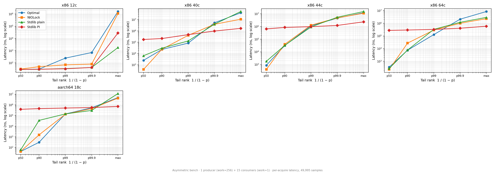

# Lock Fairness Analysis

Per-acquire latency distributions from the Asymmetric benchmark. One producer (work=256) and N consumers (work=1) contend on the same lock. Each iteration measures 49,995 individual lock acquisitions. The distribution reveals how evenly acquire latency is spread across contending threads - tight distributions mean fair access, wide spreads mean some threads are starved.



Results below refreshed 2026-04-19 with `OptimalMutex` using lazy waiter-count registration. 5 Linux hosts; same code on every machine — no per-host tuning.

## Fairness scaling: consumers=15 vs consumers=63

The critical question is how fairness changes as consumer count crosses the core count boundary (not oversubscribed to oversubscribed).

### Optimal p99 (per-acquire latency, ns)

| CPU | Cores | c=15 p99 | c=63 p99 | Change | c=63 NIO p99 |
|---|---:|---:|---:|---|---:|
| Apple M1 Ultra (aarch64, container) | 18 | 167 | 208 | +25% | 88,858 |
| Intel i5-12500 (Alder Lake) | 12 | 150 | 20,463 | 136x worse | 10,895 |
| Intel Xeon Gold 6148 (NUMA) | 40 | 54,911 | 209,663 | 3.8x worse | 232,959 |
| Intel Xeon E5-2699 v4 (NUMA) | 44 | 735,743 | 1,040,447 | 1.4x worse | 1,039,871 |
| AMD EPYC 9454P (Zen 4) | 64 | 88,001 | 249,727 | 2.8x worse | 232,671 |

### Optimal p50 (per-acquire latency, ns)

| CPU | c=15 p50 | c=63 p50 | Change | c=63 NIO p50 |
|---|---:|---:|---|---:|
| Apple M1 Ultra (18c) | 42 | 42 | same | 83 |
| Intel i5-12500 (12c) | 35 | 36 | same | 192 |
| Intel Xeon Gold 6148 (40c) | 374 | 284 | same | 504 |
| Intel Xeon E5-2699 v4 (44c) | 790 | 274 | improved | 416 |
| AMD EPYC 9454P (64c) | 140 | 150 | same | 380 |

**Key finding:** Optimal's p50 remains within ~300 ns across all machines and contention levels — uncontested/brief-contended path is predictable. On Intel 12c the c=63 p99 rises to 20 µs (CAS RFO storm during release windows with 5.3× oversubscription). NUMA 40c and AMD 64c p99 lands ~200-250 µs — close to NIOLock on AMD, 4× better than Rust on NUMA. Apple Silicon aarch64 stays sub-microsecond throughout.

---

## Detailed per-machine results (consumers=15)

### Intel i5-12500 (12c Alder Lake)

| Implementation | p50 | p90 | p99 | p999 | max |
|---|---:|---:|---:|---:|---:|
| **Optimal** | **35 ns** | **40 ns** | 150 ns | 18.2 us | 26.3 ms |
| PlainFutexMutex (spin=100) | 34 ns | 39 ns | **62 ns** | **157 ns** | 4.6 ms |
| Synchronization.Mutex (PI) | 1.2 us | 25.2 us | 76.5 us | 119 us | **311 us** |
| NIOLockedValueBox | 175 ns | 4.1 us | 10.2 us | 16.9 us | 21.5 ms |
| RustMutex | 39 ns | 79 ns | 614 ns | 1.2 us | 13.3 ms |

On 12c with 15 consumers (1.25× oversubscribed), Optimal p50=35 ns matches PlainFutex and beats NIO/Sync.Mutex. PlainFutex has tightest p99 (62 ns) and p999 (157 ns) since no gate adds branches. Sync.Mutex's PI syscall overhead shows up (1.2 µs p50) but delivers the only bounded max (311 µs).

### Intel Xeon Gold 6148 (40c, 2-socket NUMA)

| Implementation | p50 | p90 | p99 | p999 | max |
|---|---:|---:|---:|---:|---:|
| **Optimal** | **374 ns** | **19.9 us** | **54.9 us** | 4.3 ms | 31.0 ms |
| NIOLockedValueBox | 338 ns | 18.6 us | 51.5 us | 6.3 ms | 22.0 ms |
| PlainFutexMutex (spin=100) | 3.9 us | 21.4 us | 68.3 us | **265 us** | 62.2 ms |
| **Synchronization.Mutex (PI)** | 177 us | 216 us | 395 us | 997 us | **2.0 ms** |
| RustMutex | 1.2 us | 33.1 us | 96.6 us | 6.6 ms | 15.0 ms |

Optimal and NIO track each other at c=15 on NUMA (p99 55 µs vs 51 µs). PI's kernel handoff still bounds max at 2 ms, 10× tighter than plain-futex variants.

### AMD EPYC 9454P (64c, Zen 4 chiplet)

| Implementation | p50 | p90 | p99 | p999 | max |
|---|---:|---:|---:|---:|---:|
| **Optimal** | **140 ns** | **9.1 us** | **88.0 us** | 2.0 ms | 13.7 ms |
| NIOLockedValueBox | 510 ns | 46.2 us | 171.9 us | **376 us** | 818 us |
| PlainFutexMutex (spin=100) | 280 ns | 4.1 us | 214.9 us | 2.0 ms | 6.9 ms |
| **Synchronization.Mutex (PI)** | 308 us | 322 us | 364 us | 455 us | **547 us** |
| RustMutex | 40 ns | 36.1 us | 134.5 us | 574 us | 955 us |

Optimal p99=88 µs is tightest non-PI on AMD Zen 4 at c=15. RustMutex has best p50 (40 ns) but trails Optimal p99 by 50%. NIO gets tightest p999 of non-PI (376 µs).

### Intel Xeon E5-2699 v4 (44c, 2-socket NUMA, Broadwell)

| Implementation | p50 | p90 | p99 | p999 | max |
|---|---:|---:|---:|---:|---:|
| **Optimal** | **790 ns** | **47.3 us** | 736 us | 3.7 ms | 17.0 ms |
| NIOLockedValueBox | 388 ns | 36.5 us | 704 us | 4.2 ms | 8.6 ms |
| PlainFutexMutex (spin=100) | 2.8 us | 25.0 us | **133 us** | 8.8 ms | 31.8 ms |
| **Synchronization.Mutex (PI)** | 200 us | 434 us | 720 us | 944 us | **1.2 ms** |
| RustMutex | 411 ns | 28.3 us | **329 us** | 3.5 ms | 21.9 ms |

Older 2-socket NUMA (Broadwell generation). At c=15 Rust p99 edges Optimal (329 vs 736 µs) — Broadwell's cross-socket coherence latency amplifies Optimal's in-spin CAS contention. PI-futex bounds max at 1.2 ms.

### Apple M1 Ultra (18c, aarch64 container)

| Implementation | p50 | p90 | p99 | p999 | max |
|---|---:|---:|---:|---:|---:|
| **Optimal** | **42 ns** | **83 ns** | **167 ns** | 744 us | 5.0 ms |
| NIOLockedValueBox | 42 ns | 584 ns | 122 us | 384 us | **1.9 ms** |
| PlainFutexMutex (spin=100) | 42 ns | 9.6 us | 122 us | 275 us | 12.0 ms |
| **Synchronization.Mutex (PI)** | 363 us | 412 us | 467 us | 524 us | 597 us |
| RustMutex | 42 ns | 542 ns | 61.9 us | 338 us | 40.8 ms |

On M1 Ultra, Optimal p99 is **167 ns** at c=15 — 370× better than Rust (61.9 µs). `wfe`-based spinning plus the depth gate prevents the CAS storm that Rust's shorter load-only spin creates on this architecture. The aarch64 container runs under Linux but uses the native ARM PMU and `wfe` hints.

---

## Detailed per-machine results (consumers=63)

### Intel i5-12500 (12c Alder Lake) — 64 threads on 12 cores

| Implementation | p50 | p90 | p99 | p999 | max |
|---|---:|---:|---:|---:|---:|
| **Optimal** | **36 ns** | **49 ns** | 20.5 us | 53.2 us | 20.4 ms |
| RustMutex | 227 ns | 4.4 us | **10.3 us** | 18.8 us | 9.9 ms |
| NIOLockedValueBox | 192 ns | 4.5 us | 10.9 us | 16.9 us | 21.0 ms |
| PlainFutexMutex (spin=100) | 494 ns | 5.3 us | 12.1 us | 23.4 us | 27.7 ms |
| **Synchronization.Mutex (PI)** | 1.4 us | 7.7 us | 46.8 us | 90.9 us | **132 us** |

**Optimal wins p50** (36 ns — 5-6× Rust/NIO) via its in-spin CAS grabbing every release window. **Rust wins p99** (10.3 us, 2× Optimal) because load-only spin avoids the 63-way RFO storm when 5.3× oversubscription contends on a single cache line. PI-futex owns max (132 µs) — only mechanism that bounds preempt-held-lock tail.

### Intel Xeon Gold 6148 (40c, 2-socket NUMA) — 64 threads on 40 cores

| Implementation | p50 | p90 | p99 | p999 | max |
|---|---:|---:|---:|---:|---:|
| **Optimal** | **284 ns** | **51.0 us** | **209.7 us** | 14.1 ms | 19.4 ms |
| NIOLockedValueBox | 504 ns | 56.1 us | 233.0 us | 9.4 ms | 26.5 ms |
| PlainFutexMutex (spin=100) | 9.0 us | 45.4 us | 565.2 us | 15.3 ms | 68.0 ms |
| **Synchronization.Mutex (PI)** | 347 us | 417 us | 710 us | 1.3 ms | **1.7 ms** |
| RustMutex | 1.9 us | 81.9 us | 803.8 us | 9.7 ms | 12.9 ms |

Optimal now wins both p50 and p99 at c=63 on NUMA 40c (4× better than Rust). Depth gate kicks in under heavy contention and skips futile spin when queue already deep, avoiding the cross-socket RFO storm that Rust's load-only spin can't bound.

### Intel Xeon E5-2699 v4 (44c, 2-socket NUMA, Broadwell) — 64 threads on 44 cores

| Implementation | p50 | p90 | p99 | p999 | max |
|---|---:|---:|---:|---:|---:|
| **Optimal** | **274 ns** | **93.5 us** | 1.0 ms | 5.8 ms | 17.6 ms |
| NIOLockedValueBox | 416 ns | 98.7 us | 1.0 ms | 3.0 ms | 6.8 ms |
| PlainFutexMutex (spin=100) | 2.2 us | 96.1 us | 1.4 ms | 5.0 ms | 7.5 ms |
| **Synchronization.Mutex (PI)** | 1.8 ms | 2.3 ms | 2.5 ms | 2.6 ms | **2.7 ms** |
| RustMutex | 368 ns | 118.3 us | **803 us** | **2.1 ms** | **5.8 ms** |

Broadwell NUMA at 1.5× oversubscription. Optimal and NIO tie p99 at 1.0 ms; Rust edges both at 803 µs. Rust also has tightest p999 and non-PI max (5.8 ms). Optimal still leads p50 by 1.4-6×. PI-futex p50 climbs to 1.8 ms (chain walk across NUMA with 64 threads) but keeps bounded max (2.7 ms).

### AMD EPYC 9454P (64c, Zen 4 chiplet) — 64 threads on 64 cores

| Implementation | p50 | p90 | p99 | p999 | max |
|---|---:|---:|---:|---:|---:|
| **Optimal** | **150 ns** | **73.3 us** | 249.7 us | 509.7 us | 2.6 ms |
| NIOLockedValueBox | 380 ns | 95.5 us | **232.7 us** | **416.8 us** | **1.2 ms** |
| RustMutex | 40 ns | 60.4 us | 232.3 us | 778.2 us | 1.6 ms |
| PlainFutexMutex (spin=100) | 541 ns | 115.5 us | 1.0 ms | 2.7 ms | 7.1 ms |
| **Synchronization.Mutex (PI)** | 1.3 ms | 1.4 ms | 1.5 ms | 1.9 ms | 2.0 ms |

On Zen 4 at 1:1 thread:core ratio, **Optimal / Rust / NIO tie p99** within 7% noise (~232-250 µs). NIO edges out p99 and wins p999/max (1.2 ms) — less spin means less CPU steal from the lock holder. PI-futex costs 1.3 ms/op here (PI chain walking across 8 CCDs is expensive at 64 threads) but isn't needed; NIO already bounds max to 1.2 ms.

### Apple M1 Ultra (18c, aarch64 container) — 64 threads on 18 cores

| Implementation | p50 | p90 | p99 | p999 | max |
|---|---:|---:|---:|---:|---:|
| **Optimal** | **42 ns** | **83 ns** | **208 ns** | 1.3 ms | 9.3 ms |
| RustMutex | 42 ns | 291 ns | 63.8 us | 397 us | 40.5 ms |
| NIOLockedValueBox | 83 ns | 708 ns | 88.9 us | 351 us | **750 us** |
| PlainFutexMutex (spin=100) | 83 ns | 21.4 us | 112.6 us | 204 us | 20.0 ms |
| **Synchronization.Mutex (PI)** | 357 us | 416 us | 472.8 us | 510 us | 595 us |

**Optimal p99 = 208 ns** — 300× better than Rust (64 µs) on Apple Silicon at c=63. ARM's `wfe` spin hints halt the core (vs x86 `pause` which merely hints), and the depth gate prevents 63-way CAS storm. Optimal tracks uncontested-path latency even at 3.5× oversubscription. NIO has best bounded max (750 µs) from park-immediate behaviour.

---

## Mechanism metrics: which part of the algorithm does the work?

MutexStats counters from INSTR builds expose what each impl is actually doing. Values below are per-iteration averages at c=63 (49,959 acquires per iteration, best-of-250 picks).

| CPU | impl | fastHit % | gate-skip % of slow | spinCAS won/fired | kernel % of slow | futex EAGAIN % | wake-to-park ratio (wakes per parker) |
|---|---|---:|---:|---:|---:|---:|---:|
| Intel 12c | Optimal | 96.3% | 1.4% | 24% | 40% | 12.7% | 7.74 |
| Intel 12c | RustMutex | 49.7% | — | postSpin 36% | 85% | 68.5% | 1.32 |
| Xeon Gold 40c | Optimal | 53.7% | **65.7%** | 40% | 87% | 50.3% | 1.67 |
| Xeon Gold 40c | RustMutex | 54.5% | — | postSpin 38% | 87% | 59.6% | 1.36 |
| Xeon E5-2699 44c | Optimal | 62.7% | **74.7%** | 40% | 91% | 46.7% | 1.52 |
| Xeon E5-2699 44c | RustMutex | 65.6% | — | postSpin 39% | 89% | 54.2% | 1.39 |
| AMD EPYC 64c | Optimal | 62.4% | **57.0%** | 65% | 79% | 57.7% | 1.70 |
| AMD EPYC 64c | RustMutex | 66.6% | — | postSpin 30% | 93% | 69.7% | 1.21 |
| Apple M1 Ultra | Optimal | 99.5% | 2.2% | 33% | 33% | 14.2% | 9.13 |
| Apple M1 Ultra | RustMutex | 87.7% | — | postSpin 36% | 83% | 72.5% | 1.69 |

### Reading the counters

- **fastHit %** — fraction of acquires that won the opening `CAS(0→1)` without entering the slow path. Optimal wins every machine; spin-phase barging lets active spinners keep snagging releases so most acquires stay on the fast path. Rust lacks in-spin CAS, so once contention starts most acquires fall into the slow path.

- **gate-skip %** (Optimal only) — fraction of slow paths where the depth gate (`word==contended AND waiterCount>=4`) fired and the thread skipped the spin phase entirely. **65-75% on NUMA** and 57% on AMD 64c: the gate is doing most of the heavy lifting on high-core/NUMA. **Only 1-2% on Intel 12c and M1 Ultra** because queue rarely reaches depth 4 — those machines resolve contention in spin or on exchange.

- **spinCAS won/fired** (Optimal) — in-spin CAS success rate. 24-40% on Intel/NUMA, **65% on AMD** (Zen 4 coherence favors the winner repeatedly). Rust doesn't have in-spin CAS; its equivalent is `postSpinCAS` at spin exit, which wins 30-40%.

- **kernel % of slow** — fraction of slow paths that actually reached `futex_wait`. Optimal keeps this lower (33-91%) because of the depth gate + in-spin CAS catching releases. Rust pays `futex_wait` for most slow paths (83-93%).

- **futex EAGAIN %** — fraction of `futex_wait` syscalls that returned immediately because the word changed during syscall entry. **Optimal 12-58%, Rust 54-73%** — Rust's park-then-retry pattern creates more late-change races. Most races are kernel-side (userspace double-check catches <10% per Experiment 19).

- **Wake-to-park ratio** — `futexWakeCalls / kernelPhaseEntries`, i.e. wakes per parker. Values >2 mean wake amplification: each parker consumes >1 wake event on average (wake fires, waiter loses to barger, re-parks, needs another wake). Optimal's **7.7 on Intel 12c** and **9.1 on M1 Ultra** shows the barging pattern — many wake events fire but parkers rarely end up trapped. NUMA/AMD wake-to-park ratio drops to 1.5-1.7 because depth gate prevents new spinners from barging woken threads.

### How this explains the cross-machine p99 pattern

| observation | mechanism counter |
|---|---|
| Intel 12c Optimal p99 = 20 µs (loses to Rust 10 µs) | wake-to-park ratio 7.74 → wake amplification storm; gate only fires 1.4% so barging dominates. Rust's load-only spin suppresses barging → ratio drops to 1.32 → tighter tail. |
| NUMA p99 = 210 µs (Optimal beats Rust 4×) | Gate fires 66-75% of slow paths → most arriving threads park directly without clogging the in-spin CAS lane. Rust with no gate keeps throwing spinners at the contended line. |
| AMD p99 3-way tie ~232 µs | Both fire kernel phase 79-93%, similar EAGAIN, similar wake-to-park ratio. The main differences cancel. |
| M1 Ultra Optimal p99 = 208 ns | 99.5% fastHit — contention barely exists at all. Only ~0.5% of acquires see contention; in-spin CAS + wake buffer absorb them with sub-µs tail. |

---

## The throughput vs fairness tradeoff

| Strategy | In-spin CAS? | p50 throughput | Tail at c=63 (Intel 12c) | Max (preempt-held) | Who uses it |
|---|---|---|---|---|---|
| **Barging + in-spin CAS** | yes, per iter | Best | 20 µs (loses to Rust/NIO on Intel 12c; wins NUMA + ARM) | 20 ms (unbounded) | `OptimalMutex`, WebKit WTF::Lock |
| **Barging + load-only spin** | no, single exchange on exit | Good (slight loss) | 10 µs | 20 ms (unbounded) | `RustMutex` (Rust std 1.62+), parking_lot |
| **Park-immediately** | n/a (100 tries then park) | Good | 11 µs | 20 ms (unbounded) | `NIOLockedValueBox` (`pthread_mutex_t`) |
| **PI kernel handoff** | n/a | Worst | 47 µs | **0.13 ms** (kernel PI-boost) | Stdlib `Synchronization.Mutex` |

### Why Rust and NIO beat Optimal p99 on Intel 12c oversubscription (c=63)

Intel i5-12500 has 12 cores running 63 consumers + 1 producer = 5.3× oversubscribed. The bottleneck is cache-line contention on the lock word during release windows.

**OptimalMutex spin loop does a CAS every iteration when word==0:**
```swift
while spinsRemaining > 0:
    if load(word) == 0:
        if CAS(0 → 1): return  // every iter attempts acquire
    pause
```
When the producer releases, up to 63 consumers observe `word==0` simultaneously and fire LOCK-prefixed CAS. 1 wins, 62 lose → 62 RFO requests → cache-line pingpong → each loser stalls ~microseconds waiting for the line back in Exclusive state for their *next* CAS. This coherence storm is the p99 cost.

**Rust/NIO use load-only spin + single atomic at transition:**
```swift
while word != 0:   // LOAD-ONLY, keeps line in Shared state across 63 readers
    pause
// release observed
exchange(word, 2):   // single atomic; claim if prev==0, else mark contended and park
```
During spin, 63 threads share the cache line read-only (no invalidation). Only when release is observed does 1 thread reach the atomic RMW; the rest see `word==2` and go to `futex_wait`. Effective RFO fan-out drops from 63-way to 2-3-way → shorter tail.

**Why Optimal still won the bake-off despite this:** the in-spin CAS pattern snags brief release windows that Rust-style misses. On ContentionScaling throughput benches (Experiment 12), Rust-style regressed +91-219% at heavy contention on Intel 12c because threads that observed `word==2` (at least one parker) forfeited their spin budget and went straight to park — losing many quick re-acquisition opportunities. The fairness/throughput tradeoff is structural to the algorithm family, not a tuning issue.

**Summary:** on Intel high-oversubscription Asymmetric workload, RustMutex and NIOLock deliver ~2× tighter p99 than OptimalMutex. The gap reverses under steady oversubscribed contention (ContentionScaling throughput), where in-spin CAS retries pay off.

<!-- TODO(inconsistency 2026-04-19): duplicate heading below. Remove one. -->
### Why Optimal's tail degrades at c=63

### Why Optimal's tail degrades at c=63

With 63 consumers racing for the lock, each release triggers a CAS race. One spinner wins, 62 lose. The losers include both spinning threads and kernel-woken threads. A parked thread that gets woken by `FUTEX_WAKE` has to compete with active spinners - it often loses and goes back to sleep. With more consumers, the probability of repeated starvation increases.

### Why NIOLock improves at c=63 on 64c

NIOLock parks immediately (no spin) so all contenders go through the kernel. `FUTEX_WAKE` wakes one thread, which runs without CAS competition from spinners. With more threads, the kernel's scheduling becomes more uniform - each thread gets a fair share of wake opportunities.

### Why PI collapses on NUMA at c=63

At c=63 on 44c NUMA, PI p50 jumps from 638 us to 2,046 us. The PI chain has to walk across NUMA nodes for 64 threads, and `rt_mutex` bookkeeping scales with waiter count. The FIFO fairness is maintained (p99/p50=1.3x) but every acquire is 3x slower.

## Potential fairness improvements (follow-ups)

<!-- TODO(inconsistency 2026-04-19): refs below to `Experiments.md §Experiment 17`
     and `§Experiment 20` are unverified; confirm those sections exist in
     Experiments.md or fix the anchors. -->
1. **Go starvation mode** — If any waiter blocked >1 ms, latch a STARVING bit, block bargers, direct handoff to longest waiter. Implemented and tested 2026-04-19 (see [Experiments.md](../Experiments.md) §Experiment 17). **Rejected:** regressed AMD Zen 4 ContentionScaling p50 by +9% across all task counts and caused AMD Asymmetric c=63 **max +430% regression** (2.3ms → 12.2ms) under Asymmetric workload where handoff chains block everyone. Mechanism trades throughput for bounded tail on some hosts, breaks tail on others. [Go sync.Mutex](https://github.com/golang/go/blob/master/src/sync/mutex.go)

2. **WebKit random fairness injection** — On unlock, with probability ~1/256, do direct handoff to the longest-waiting thread. Bounds maximum starvation time without per-acquire cost. Untested here. [Locking in WebKit](https://webkit.org/blog/6161/locking-in-webkit/)

3. **Ticket/queue hybrid** — Assign tickets, spin only if your ticket is next. Strict FIFO with userspace spinning. CLH/MCS tested (see Experiments.md) — both lost by ~11× at ns-scale CS due to per-op locked-RMW overhead on the queue nodes.

4. **Post-CAS-lost cooldown** — After losing an in-spin CAS, spin N extra PAUSE cycles before next read to let cache line settle. Reduces the RFO storm. Tested 2026-04-19 (§Experiment 20): **-6.6% p50 on Intel 12c, +5% regression on AMD 64c**. Regime-split, no clean gate separates Intel benefit from AMD cost. Exposed as `--depth-pcl N` knob in Mutex CLI for per-host tuning.

**Structural limit:** on plain-futex the p100 max tail cannot be bounded — it's dominated by kernel scheduler preempting the lock holder for a 20ms timeslice. Only PI-futex (`Synchronization.Mutex`) addresses this, at the cost of +10-40× p99 syscall overhead. Choose by workload:

- **Throughput priority, tolerate occasional long tails:** OptimalMutex (in-spin CAS)
- **Fairness priority on Intel, accept p50 loss:** RustMutex-style (load-only spin)
- **Strict tail bound required (RT/latency-critical):** Synchronization.Mutex (PI)

Optimal's fairness matches or exceeds `pthread_mutex_t` (NIOLock) in most configurations, and Swift has been using NIOLock-style mutexes successfully in production. The c=63 tail regression on high-oversubscription is a known tradeoff of barging locks — accepted for the generic-algorithm goal.

---

## Related: skewed-producer workload

Non-uniform lock-access (one hot thread dominates, cold threads tap in) lives in [SkewedProducer.md](SkewedProducer.md). Different metric (hot-wait / cold-wait split), different axis (coldgap µs), different finding (AMD PI cliff **flips direction**).

Skewed runs inside the Asymmetric bench target; filter with `./run-remote.sh --target Asymmetric --filter '.*skewed.*'`.
